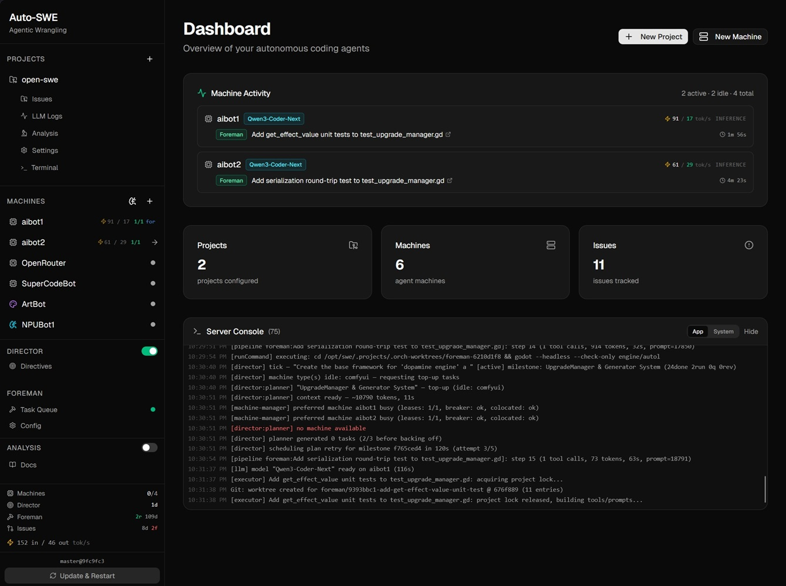

# auto-swe

This is an exploration of agent orchestration, not intended to be a complete product. If you're looking to build your own agent stack, I highly recommend [Hermes Agent](https://github.com/nousresearch/hermes-agent) or [OpenHands](https://github.com/OpenHands/OpenHands) as a more complete starting point. If you're looking to explore architecture and patterns around agentic orchestration, continue on.

An autonomous software engineering orchestration system. Takes high-level directives ("build a tower defense game"), decomposes them into milestones and tasks, dispatches work to LLM agents running on separate inference machines, runs code review and gated build/test checks, and generates art / music / SFX through ComfyUI — all with configurable human oversight.

Single-host control plane, multi-machine execution. Built with Claude as a development tool.

*Personal homelab project. Open source and generalized enough for anyone to run and extend, but not actively monitoring issues / PRs.*

Detailed documentation & visualizations are available in [`docs/architecture/`](docs/architecture/)

Agents read [`AGENTS.md`](AGENTS.md)

The agent failure modes observed while building this system motivated a separate project: [**inspect-degradation**](https://github.com/reffdev/inspect-degradation), a step-level evaluation pipeline for measuring within-run agent behavior.



## What it does

- **Director** - chats with you, drafts a design doc, decomposes it into milestones, plans task batches, and verifies completed work.
- **Foreman** - schedules tasks onto inference / ComfyUI / NPU machines, runs LLM agents inside isolated git worktrees, and gates submissions on build / test / lint.
- **Issues Pipeline** - multi-stage processing for standalone issues: scout → implement → build → test → review → git ops, with cache-friendly multi-lens code review (~77% token savings across lenses).
- **Memory** - persistent `.swe/` directory per project: conventions, semantic notes, episodic activity logs, with semantic search via an external `memsearch` CLI.
- **Sandbox** - optional per-subprocess isolation via [bubblewrap](https://github.com/containers/bubblewrap) on Linux, with per-stage network and worktree-write policies.
- **Voice** (optional) - STT / LLM / TTS pipeline using llama.cpp + Piper.

## Design decisions

This is the third iteration of the architecture. The first two prototypes failed in ways that shaped most of the current design.

**Agent scope enforcement.** The most frequent failure mode across prior iterations was scope creep: an agent assigned a small task would discover a problem in adjacent code, begin debugging an unrelated subsystem, and consume its entire session without producing assigned work. The current system enforces scope boundaries via prompt constraints — agents that encounter out-of-scope problems must note them in their result and move on. Stall detectors (below) serve as the mechanical backstop when agents ignore the prompt.

**Empirical stall detection.** Agents do not degrade gradually — they fall into categorical failure patterns. Three dominant patterns emerged from observing runs across prior iterations, each with a dedicated detector: tool-call loops (identical tool + arguments repeated consecutively), no-write streaks (30+ steps of reading and searching without editing code), and inspection-command burns (25+ consecutive shell commands without meaningful action). Thresholds were derived from observed failure distributions across real runs.

**Memory write validation.** Agents given unrestricted write access to persistent memory treat it as a scratchpad — producing ephemeral status notes, dated entries, TODO lists, and duplicates. Within a single session the memory directory would fill with content that crowded out stable knowledge. All memory writes now pass through validators that reject junk patterns, block same-day duplicate writes on the same topic, and enforce per-invocation quotas. A separate admin scan applies the same patterns to existing files for periodic cleanup.

**Strict review prompts.** Early iterations used review prompts with exception language ("don't flag minor style issues"). Agents treated every exception as a general escape hatch, passing clearly incorrect code by categorizing problems as minor. The current 11-lens review system uses strict prompts with explicit reject criteria per lens and no exception language. A three-part prompt structure (shared system + shared context + lens-specific instructions) caches the invariant portions across all 11 lenses, yielding ~77% token savings.

## Architecture

```
Frontend (React + Vite)
        │
        ▼
Express server (Node, SQLite/WAL, Drizzle ORM)
        │
        ├─ Director (conversation, planner, verifier, memory)
        ├─ Foreman  (scheduler, executor, validator, routing)
        ├─ Issues Pipeline (scout → implement → review → gitops)
        └─ Machine Manager (lease-based access control)
                │
                ▼
        ┌───────┴────────┬──────────────┐
        ▼                ▼              ▼
   Inference         ComfyUI           NPU
   (Ollama /         (SDXL,            (small fast
    OpenRouter /      FLUX,             models for
    llama.cpp)        ACE-Step,         lightweight
                      AudioGen)         helpers)
```

LLM dispatch goes through one of three entry points in `src/server/llm-dispatch.ts`: `withLlmSession` (logical-model resolution), `withLightLlmSession` (NPU lightweight), `withLightOrFallbackLlmSession`. The machine manager handles leases, colocation release, warmup, and cleanup automatically.

A more detailed architecture walkthrough lives in [`docs/architecture/`](docs/architecture/).

## Requirements

- Node.js 20+
- SQLite (bundled via better-sqlite3)
- Git (for worktree-based task isolation)
- One or more inference machines reachable over HTTP exposing an OpenAI-compatible API (llama.cpp, llama-swap, Ollama, OpenRouter, etc.)
- (Optional) ComfyUI instance for art / music / SFX tasks
- (Optional) Linux + `bubblewrap` for agent subprocess sandboxing
- (Optional) `memsearch` CLI for semantic memory search

## Quick start

```bash
git clone <this repo>
cd open-swe
npm install
cp .env.example .env       # edit as needed
npm run dev                # vite + tsx watch, frontend on :5173, server on :3001
```

Open the dashboard, add a project, add an inference machine (point its `base_url` at your OpenAI-compatible endpoint), bind a logical model to it, then create a directive.

## Build

```bash
npm run build      # production build (server + frontend)
npm test           # jest suite (~880 tests)
npx tsc --noEmit   # type check
```

## Configuration

All runtime config lives in `.env` (see [`.env.example`](.env.example)) plus the SQLite database. Machines, models, bindings, and the Director / Foreman model slots are configured through the frontend (`/models`, machine detail pages, foreman config page) - nothing about machines or API keys needs to live in source.

## Key concepts

- **Logical models** - a model (e.g. "Qwen3 Coder 30B") is decoupled from any specific machine. A *binding* connects a logical model to a machine and supplies the per-machine `provider_id` string. The same logical model can be hosted on multiple machines.
- **Director slot / Foreman code slot** - two configured slots in `foreman_config` decide which logical model the Director and Foreman default to. Per-task overrides are supported.
- **Leases** - every LLM call acquires a machine lease with an idle timeout. Leases auto-renew on activity and abort the in-flight stream on expiry. No leaked machines.
- **Worktrees** - every code task runs in its own git worktree, so concurrent tasks on the same project don't collide.
- **Review lenses** - 11 focus areas (general, security, ui, performance, testing, error_handling, react, typescript, node, express, sqlite). Cache-friendly prompt structure shares system + context across lenses.

## License

Mozilla Public License Version 2.0 - see [LICENSE](LICENSE).

## Acknowledgments

Architecture inspired by [`langchain-ai/open-swe`](https://github.com/langchain-ai/open-swe), though not directly based on their codebase.
