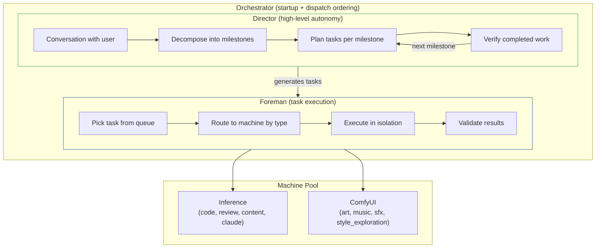
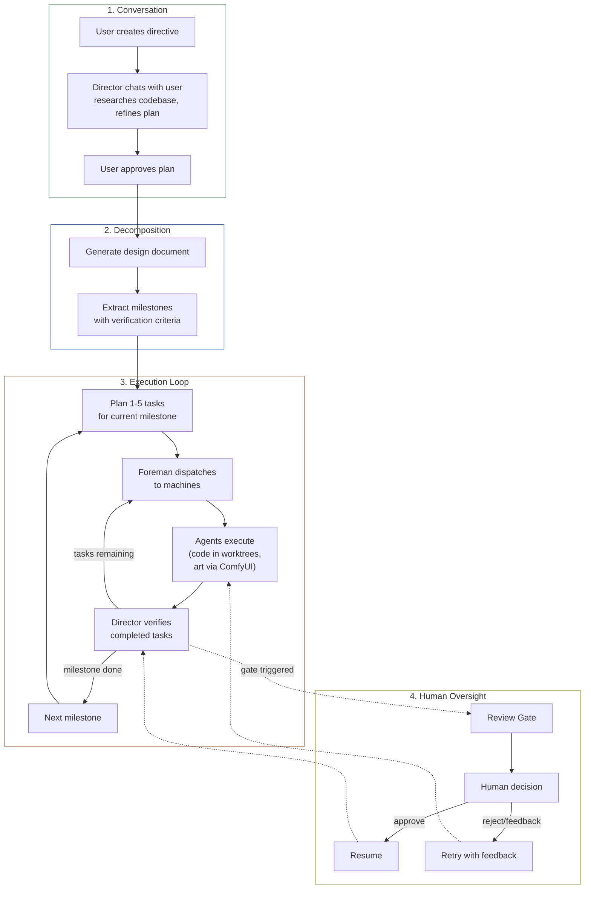
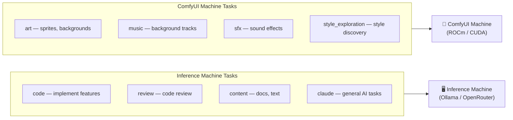
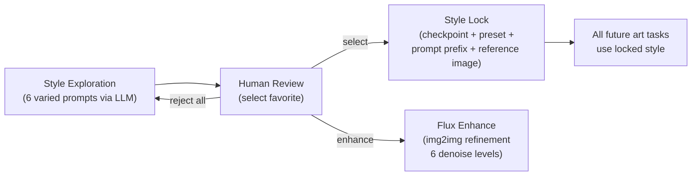
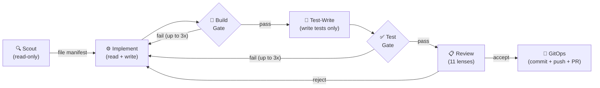
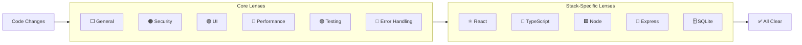
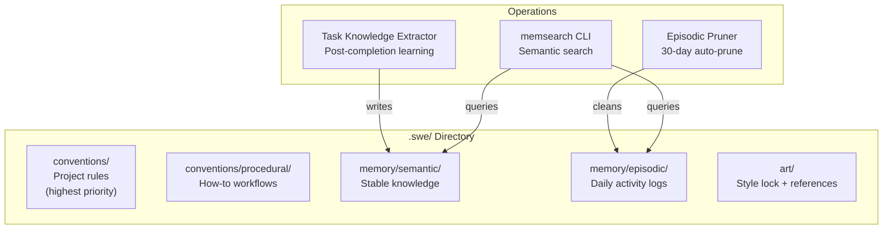
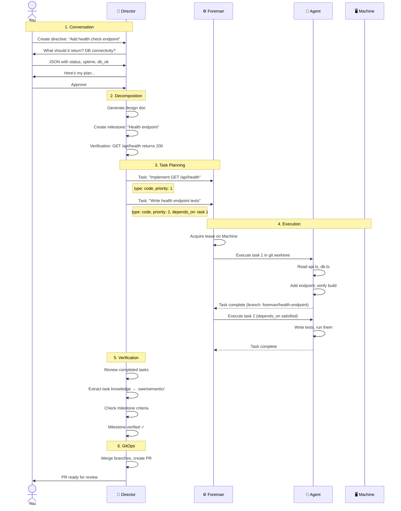

# How It Works

You describe what you want. The Director breaks it down, the Foreman dispatches work to AI agents, reviews happen automatically, and PRs get opened — all with human oversight at configurable gates.

## The Big Picture

```mermaid
graph LR
    You["🧑 You"]
    Directive["💬 Directive\n(describe what you want)"]
    Milestones["📋 Milestones\nwith tasks"]
    Agents["🤖 Agents\ncode, art,\nmusic, review"]
    Result["🔀 Pull Requests\n+ Assets"]

    You --> Directive --> Milestones --> Agents --> Result --> You

    style You fill:#2d4a22
    style Directive fill:#1e3a5f
    style Milestones fill:#1e3a5f
    style Agents fill:#1e3a5f
    style Result fill:#2d4a22
```

## Two-Level Orchestration

The system has two orchestration levels, managed by a central Orchestrator:

**Director** handles the strategic layer: talking to the user, decomposing directives into milestones, generating task batches, verifying results, and managing memory.

**Foreman** handles the tactical layer: dispatching tasks to machines, executing code in git worktrees, running ComfyUI workflows for art/music, and validating outputs.

The **Orchestrator** ensures correct startup order (Director gets first tick, Foreman waits) and prevents the Foreman from dispatching to machines the Director has reserved.

## Director Flow

## Task Types and Routing

Tasks route to different machine types based on their type:

## Review Gates (Human-in-the-Loop)

The Director creates review gates at key decision points. Gate behavior depends on the directive's autonomy level:

| Gate Type | Conservative | Standard | Aggressive |
|-----------|:----------:|:-------:|:---------:|
| Task verification | Pause | Pause | Pause |
| Design choice | Pause | Skip | Skip |
| Milestone completion | Pause | Pause | Skip |
| Failure escalation | Pause | Pause | Pause |
| Style selection | Pause | Pause | Pause |

Art-related review gates don't block code task planning — only the art pipeline pauses.

## Art Style System

For directives that include art assets, the Director manages style consistency:

Style exploration generates prompts with 4–6 specific colors each, varied rendering techniques, and no UI elements. When continuous exploration is enabled, new prompts are auto-queued after each batch.

## The Pipeline (Single-Issue Execution)

For standalone issues (not part of a directive), the original pipeline still operates:

See [Pipeline Stages](02-pipeline-stages.md) for details.

## Review Lenses

Every code change gets reviewed through focused lenses — like having multiple specialists look at the same PR:

Reviews use a cache-friendly three-part prompt structure (system + shared context + lens-specific instructions) for ~77% token savings across lenses. See [Review Lenses](03-review-lenses.md) for all 11 lenses.

## Memory System

The Director maintains persistent knowledge across tasks:

- **Conventions** and **procedural** docs are always injected into Director context
- **Semantic** and **episodic** memories are searched via memsearch (not dumped)
- **Task Knowledge Extractor** analyzes completed tasks (git diff + agent output) for reusable patterns: conventions, API patterns, gotchas, architecture decisions
- **Episodic logs** auto-prune at 30 days (patterns extracted first via LLM)
- **Unattributed commit tracking** detects manual/external commits not linked to foreman tasks

### Memory write validators

The Director (and Foreman, via a curated subset) has tools to write memory —
but those writes are filtered through `validateMemoryWrite` in `memsearch.ts`
to keep persistent memory from rotting into a junk drawer of ephemeral notes:

- **Junk filename patterns** — names like `tasks.md`, `current-status.md`,
  `pending-fixes.md`, `bugs-2026-04-08.md`, `todo.md` are rejected. Persistent
  memory is for *stable* knowledge, not state that belongs in the task DB.
- **Junk body markers** — content with phrases like `TODO`, "current
  implementation", "failed tasks", or dated section headers is rejected. If
  the content is only true today, it doesn't belong in semantic memory.
- **Same-day journaling check** — if the agent already wrote to semantic
  memory once this session for the same topic, repeated writes are blocked
  to prevent thrashing.
- **Per-category quota in the planner** — at most ~6 memory writes per
  planner invocation, so a single planning loop can't spam memory with
  duplicates.

A separate `findJunkMemories` admin scan walks existing `.swe/memory/` files
against the same patterns so users can audit and prune accumulated junk
through the frontend.

### Sandbox (Linux + bubblewrap)

Optional per-subprocess isolation gated by `foreman_config.sandbox_enabled`.
When enabled on Linux with [`bubblewrap`](https://github.com/containers/bubblewrap)
installed, every agent-spawned subprocess (the agent's `runCommand`,
`searchFiles`, gated build/test/lint checks, the verifier's mechanical
godot/build calls) runs in an isolated namespace with:

- A read-write bind of the worktree (read-only for scout / review / verify stages)
- A read-only bind of the project's `.git` directory so git worktrees resolve
- A read-only system bind of `/usr`, `/bin`, `/lib`, `/etc/ssl`, `/snap`, etc.
- A tmpfs `/tmp` and a per-task tmpfs `$HOME`
- Per-project persistent caches under `~/.swe-cache/<project_id>/` so
  `npm install` etc. don't go cold between tasks
- Per-stage network policy: implement / test-write / foreman-task get the
  network; scout / review / verify don't (a malicious `npm install`
  postinstall script literally cannot reach the host)
- Fresh PID / IPC / UTS namespaces

The orchestrator itself is **not** sandboxed — only subprocesses spawned
from inside agent execution paths. The bwrap wrapper falls through to
direct spawn on non-Linux hosts or when bwrap is missing, with a one-time
warning logged at startup. See `src/server/util/sandbox.ts` and
`docs/sandbox-smoke.md` for the manual smoke test procedure.

## Epics & Stories (Pipeline System)

Large features can be broken into independent stories that run in parallel:

```mermaid
graph TD
    Epic["📦 Epic: Add Auth System"]

    S1["Story 1\nUser model + schema"]
    S2["Story 2\nLogin endpoint"]
    S3["Story 3\nRegistration UI"]
    S4["Story 4\nSession management"]

    Epic --> S1
    Epic --> S2
    Epic --> S3
    Epic --> S4

    S1 -->|"must finish first"| S2
    S1 -->|"must finish first"| S3
    S2 -->|"both needed"| S4
    S3 -->|"both needed"| S4

    style S1 fill:#1e3a5f
    style S2 fill:#1e3a5f
    style S3 fill:#1e3a5f
    style S4 fill:#1e3a5f
```

Stories declare dependencies (`depends_on`). Stories 2 and 3 can run in parallel since they only depend on Story 1. Story 4 waits for both.

## Example: End-to-End Directive

Here's what happens when you create a directive to "add a health check endpoint":

