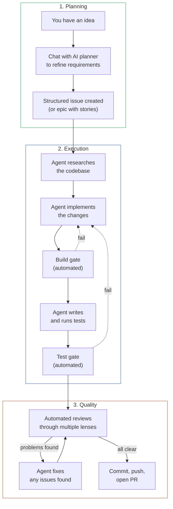
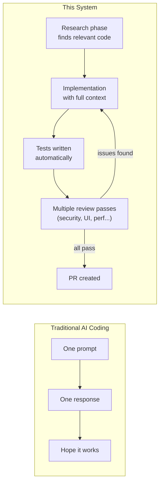
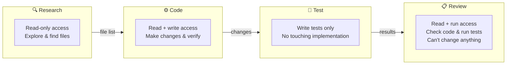
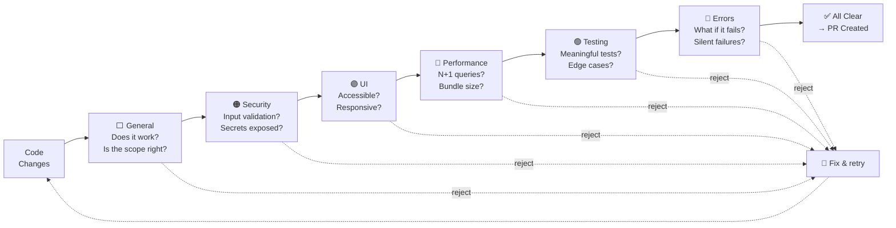
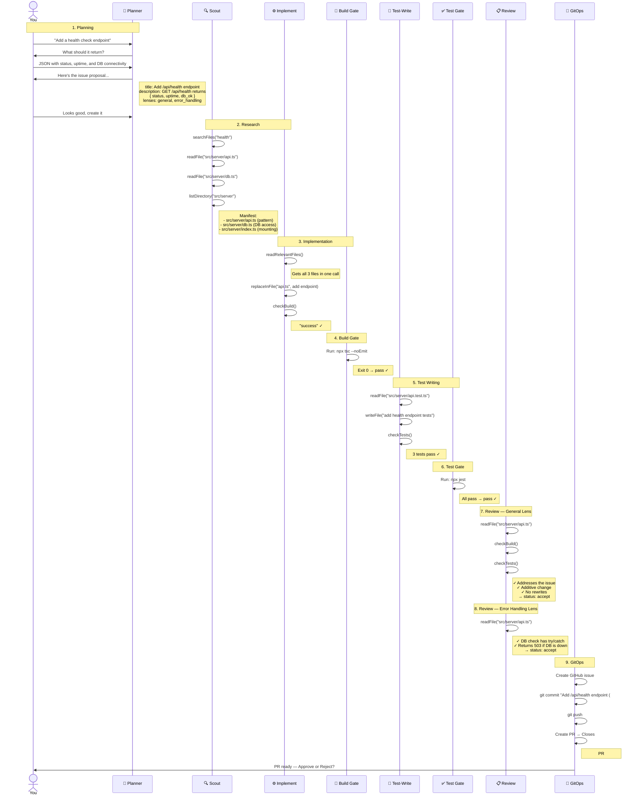

# How It Works

You describe what you want. AI agents build it, test it, review it, and open a PR.

## The Big Picture

```mermaid
graph LR
    You["🧑 You"]
    Plan["💬 Describe\nwhat you want"]
    Stories["📋 Stories\nwith requirements"]
    Agents["🤖 Agents\nresearch, code,\ntest, review"]
    PR["🔀 Pull Request\nready to merge"]

    You --> Plan --> Stories --> Agents --> PR --> You

    style You fill:#2d4a22
    style Plan fill:#1e3a5f
    style Stories fill:#1e3a5f
    style Agents fill:#1e3a5f
    style PR fill:#2d4a22
```



## From Idea to Code



## What Makes This Different



## The Agent Harness

Agents don't run free — a harness controls what they can see and do at each step.



Each stage gets **different tools**. The research agent can't write files. The test agent can't modify implementation code. The reviewer can't change anything — only read and run tests. This prevents agents from going off-script.

## Review Lenses

Every change gets reviewed through focused lenses. Think of it like having multiple specialists look at the same PR:



You choose which lenses apply per issue. A backend API change might only need General + Security + Testing. A frontend feature might need General + UI + Performance.

## Epics & Stories

Large features get broken into independent stories that can run in parallel:



```mermaid
graph TD
    Epic["📦 Epic: Add Auth System"]

    S1["Story 1\nUser model + schema"]
    S2["Story 2\nLogin endpoint"]
    S3["Story 3\nRegistration UI"]
    S4["Story 4\nSession management"]

    Epic --> S1
    Epic --> S2
    Epic --> S3
    Epic --> S4

    S1 -->|"must finish first"| S2
    S1 -->|"must finish first"| S3
    S2 -->|"both needed"| S4
    S3 -->|"both needed"| S4

    style S1 fill:#1e3a5f
    style S2 fill:#1e3a5f
    style S3 fill:#1e3a5f
    style S4 fill:#1e3a5f
```

Stories declare dependencies (`depends_on`). Stories 2 and 3 can run in parallel since they only depend on Story 1. Story 4 waits for both.

## Example: End-to-End Walkthrough

Here's what actually happens when you ask the system to add a health check endpoint:



### What the agent actually sees at each step

**Scout's file manifest:**
```
- src/server/api.ts (590 lines) — endpoint patterns to follow
- src/server/db.ts (425 lines) — DB access for health check
- src/server/index.ts (94 lines) — route mounting pattern
```

**Implementer's first action:**
```
Tool: readRelevantFiles()
Result: ### src/server/api.ts (590 lines)
        [full file contents]
        ### src/server/db.ts (425 lines)
        [full file contents]
        ...
```

**Build gate output:**
```
success
```

**Review verdict (General):**
```
status: accept
summary: Endpoint is additive, follows existing patterns,
         no signature changes, tests cover the key behaviors.
```

**Review verdict (Error Handling):**
```
status: accept
summary: DB connectivity check uses try/catch, returns 503
         on failure with useful error message. Timeout is set.
```

**Final PR:**
```
Title: Add /api/health endpoint (#42)
Body: GET /api/health returns { status: "ok", uptime: 1234, db_ok: true }
      Closes #42
```
