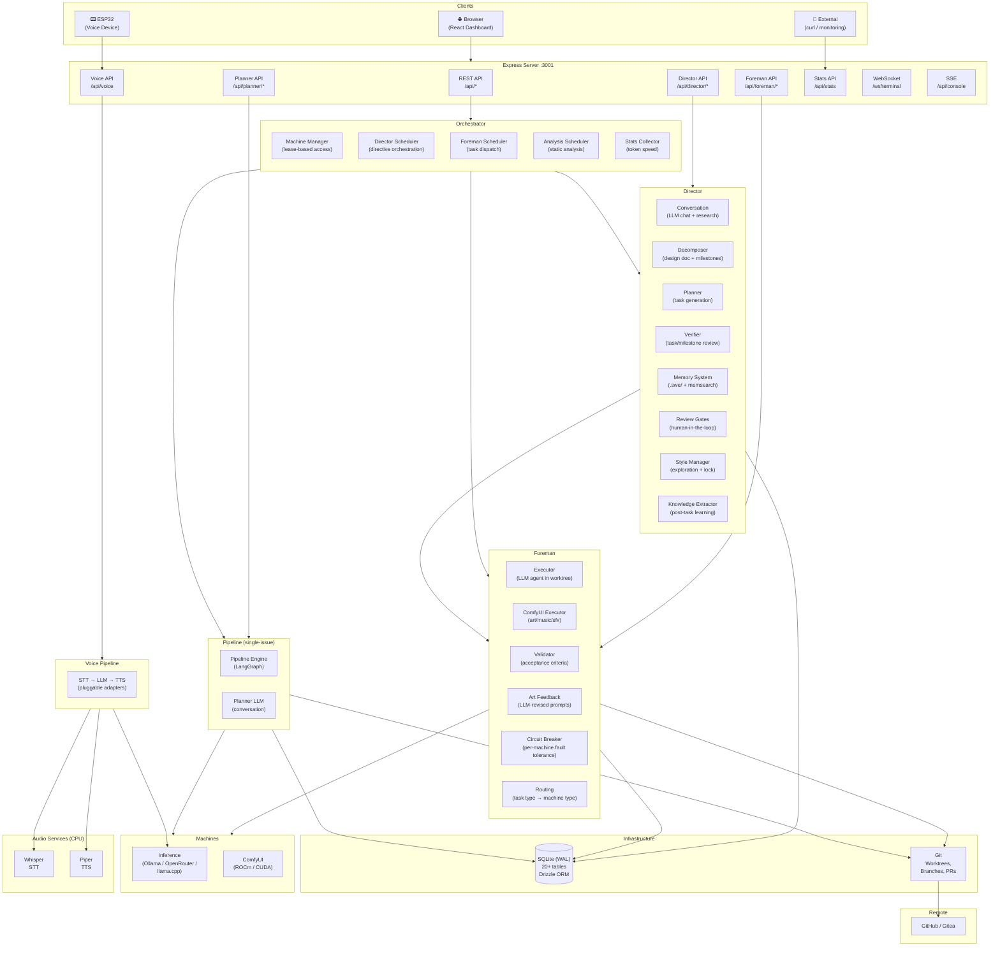
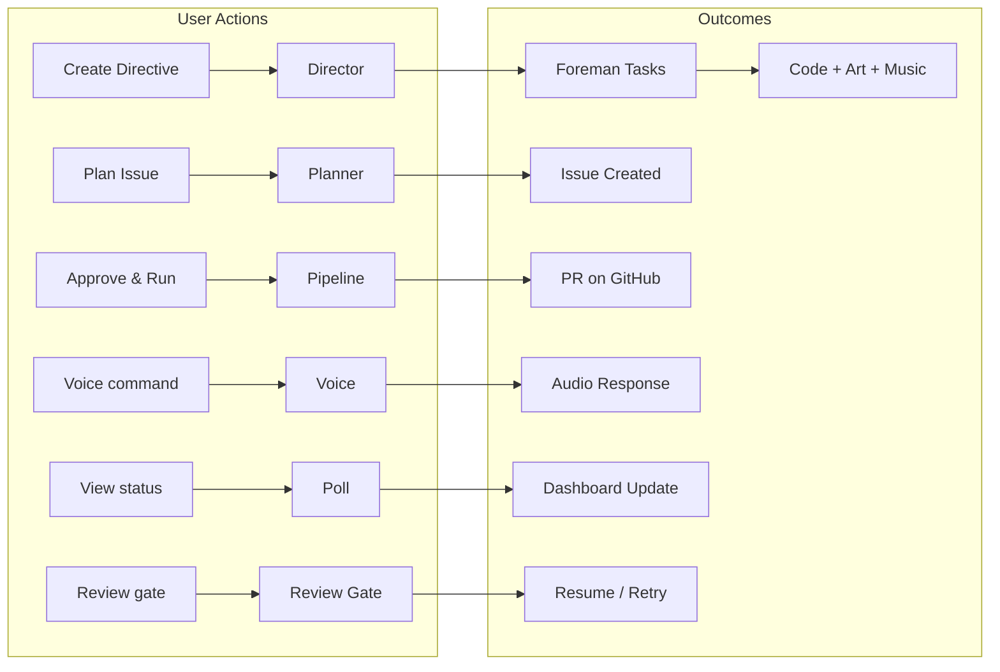

# System Overview

## Architecture Layers

## Component Summary

| Component | Role |
|-----------|------|
| **Express Server** | HTTP/WS entry point — REST API, SSE log streaming, PTY WebSocket terminal |
| **Orchestrator** | Manages startup/shutdown of all background services in correct order |
| **Machine Manager** | Lease-based access control with priority queuing, auto-expiry (5min director, 30min foreman) |
| **Director** | High-level autonomy — conversations, decomposition, planning, verification, memory, review gates |
| **Foreman** | Task-level execution — dispatch, routing, execution in worktrees/ComfyUI, validation, circuit breakers |
| **Pipeline** | Original single-issue flow — scout → implement → build → test → review → PR (LangGraph) |
| **Voice** | Speech-to-speech — pluggable STT/LLM/TTS adapters |
| **Analysis** | Scheduled static analysis with per-lens frequency tracking |

## Request Flow

## Key Files

| File | Purpose |
|------|---------|
| `orchestrator.ts` | Single entry point — startup/shutdown of all services |
| `machine-manager.ts` | Lease-based machine access with priority queue |
| `llm.ts` | Unified LLM client with resilient fetch, retry, stream monitoring |
| `api.ts` | Express routes (~40+ endpoints) |
| `schema.ts` | Drizzle ORM schema (20+ tables) |
| `db.ts` | Database abstraction + migrations |
| `git.ts` | Async worktree management, commit, PR operations |
| `git-helpers.ts` | Synchronous git queries (getHeadCommit, isDirty, getDiff) |
| `stats.ts` | Token speed tracking and performance metrics |
| `analysis.ts` | Multi-stage automated codebase analysis |
| `terminal.ts` | PTY WebSocket for Claude CLI |
| `console-log.ts` | Console log aggregation for SSE streaming |
