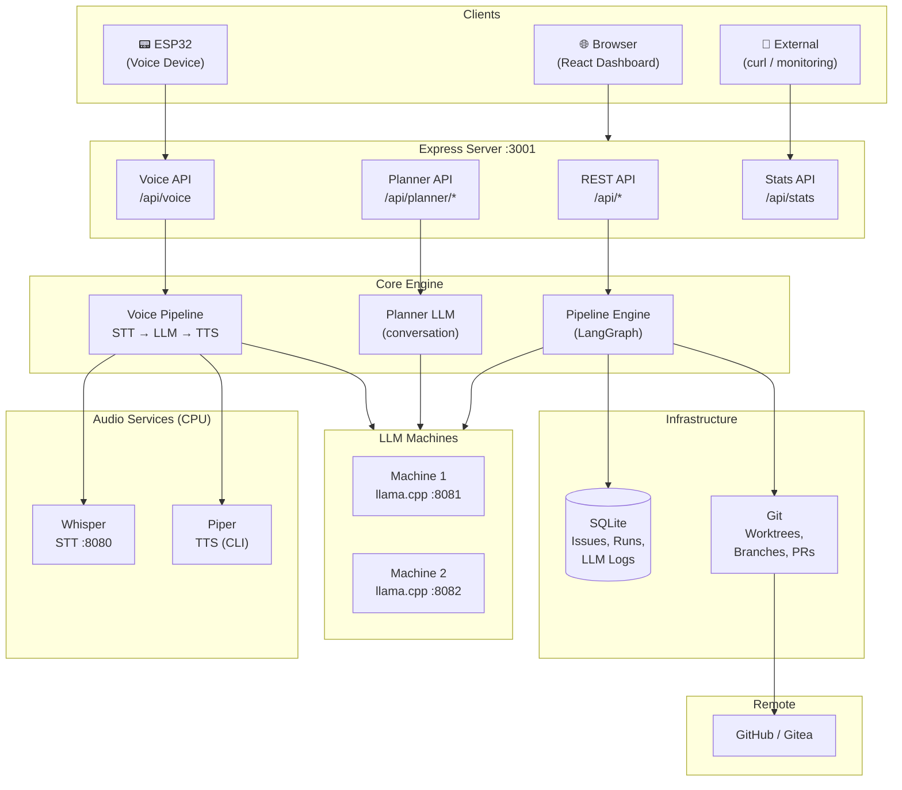
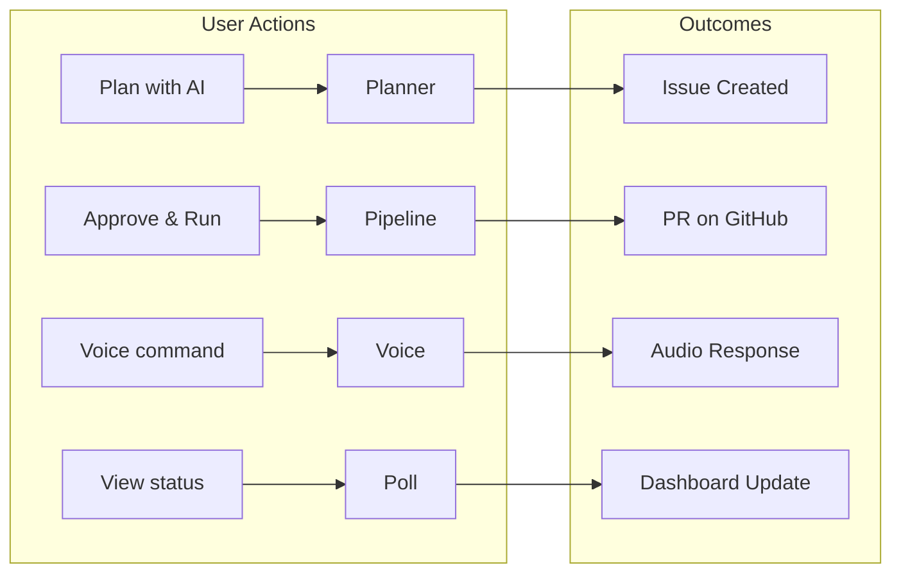

# System Overview

## Architecture Layers

```mermaid
graph TD
    subgraph Clients["Clients"]
        Browser["🌐 Browser\n(React Dashboard)"]
        ESP32["📟 ESP32\n(Voice Device)"]
        Curl["🔧 External\n(curl / monitoring)"]
    end

    subgraph Server["Express Server :3001"]
        direction LR
        API["REST API\n/api/*"]
        PlannerAPI["Planner API\n/api/planner/*"]
        VoiceAPI["Voice API\n/api/voice"]
        StatsAPI["Stats API\n/api/stats"]
    end

    subgraph Core["Core Engine"]
        Pipeline["Pipeline Engine\n(LangGraph)"]
        Planner["Planner LLM\n(conversation)"]
        Voice["Voice Pipeline\nSTT → LLM → TTS"]
    end

    subgraph Infra["Infrastructure"]
        DB[("SQLite\nIssues, Runs,\nLLM Logs")]
        Git["Git\nWorktrees,\nBranches, PRs"]
    end

    subgraph Machines["LLM Machines"]
        M1["Machine 1\nllama.cpp :8081"]
        M2["Machine 2\nllama.cpp :8082"]
    end

    subgraph Audio["Audio Services (CPU)"]
        Whisper["Whisper\nSTT :8080"]
        Piper["Piper\nTTS (CLI)"]
    end

    subgraph Remote["Remote"]
        GH["GitHub / Gitea"]
    end

    Browser --> Server
    ESP32 --> VoiceAPI
    Curl --> StatsAPI

    API --> Pipeline
    PlannerAPI --> Planner
    VoiceAPI --> Voice

    Pipeline --> Machines
    Planner --> Machines
    Voice --> Machines

    Pipeline --> DB
    Pipeline --> Git
    Git --> GH

    Voice --> Whisper
    Voice --> Piper
```

## Request Flow

```mermaid
graph LR
    subgraph User Actions
        A1["Plan with AI"] --> Planner
        A2["Approve & Run"] --> Pipeline
        A3["Voice command"] --> Voice
        A4["View status"] --> Poll
    end

    subgraph Outcomes
        Planner --> Issue["Issue Created"]
        Pipeline --> PR["PR on GitHub"]
        Voice --> Audio["Audio Response"]
        Poll --> UI["Dashboard Update"]
    end
```
