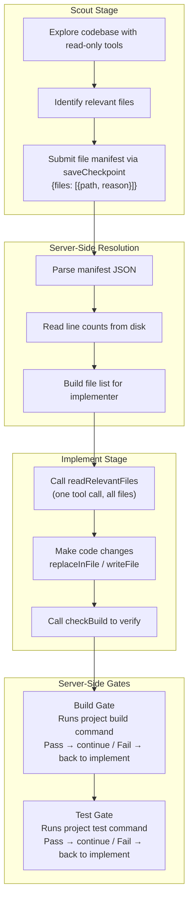

# Issues Pipeline Stages

> **Note**: The Issues Pipeline is the original single-issue execution system. For directive-based work, the [Director](00-how-it-works.md#director-flow) decomposes goals into [Foreman tasks](04-issue-lifecycle.md#foreman-task-lifecycle) instead. The Issues Pipeline remains fully functional for standalone issues.

## Stage Flow

```mermaid
graph LR
    Scout["🔍 Scout\n(read-only)"]
    Implement["⚙️ Implement\n(read + write)"]
    BuildGate{"🔨 Build\nGate"}
    TestWrite["🧪 Test-Write\n(write tests only)"]
    TestGate{"✅ Test\nGate"}
    Review["📋 Review\n(lenses)"]
    GitOps["🚀 GitOps\n(commit + push + PR)"]

    Scout -->|file manifest| Implement
    Implement --> BuildGate
    BuildGate -->|pass| TestWrite
    BuildGate -->|"fail\n(up to 3x)"| Implement
    TestWrite --> TestGate
    TestGate -->|pass| Review
    TestGate -->|"fail\n(up to 3x)"| Implement
    Review -->|accept| NextLens{More lenses?}
    Review -->|reject| Implement
    NextLens -->|yes| Review
    NextLens -->|no| GitOps

    style Scout fill:#1e3a5f
    style Implement fill:#1e3a5f
    style TestWrite fill:#1e3a5f
    style Review fill:#1e3a5f
    style GitOps fill:#1e3a5f
    style BuildGate fill:#2d4a22
    style TestGate fill:#2d4a22
```

## What Each Stage Sees and Does

## Stage Details

| Stage | Access | Key Tools | Purpose |
|-------|--------|-----------|---------|
| **Scout** | Read-only | readFile, searchFiles, listDirectory, saveCheckpoint, getRelatedStories, findStory | Find all files relevant to the issue |
| **Implement** | Read + Write | All filesystem tools, readRelevantFiles, checkBuild, checkTests, checkPackage, lookupDocs, getRelatedStories, findStory | Read files and make code changes |
| **Build Gate** | None (server-side) | Runs project's `build_command` | Automated build check — fails back to implement |
| **Test-Write** | Read + Write (tests only) | readFile, searchFiles, writeFile, runCommand, checkBuild, checkTests, checkPackage, lookupDocs | Write and run tests for the changes |
| **Test Gate** | None (server-side) | Runs project's `test_command` | Automated test check — fails back to implement |
| **Review** | Read + Run | readFile, searchFiles, runCommand, gitStatus, gitDiff, checkBuild, checkTests | Review the implementation through focused lenses |
| **GitOps** | Git operations | (internal) | Create GitHub issue, commit, push, create PR |

## Gates

Build and Test gates are **server-side checks** — no LLM calls. They run the project's configured build/test commands and check the exit code.

- Only run when the project has `build_command` / `test_command` configured (in Project Settings)
- Return `"success"` or just the extracted error messages
- On failure: send errors back to the implement stage as context
- Up to 3 retries per gate, then proceed anyway
- Show as "Build" and "Tests" steps in the UI stepper with pass/fail status

## Tools Available

| Tool | Stages | Purpose |
|------|--------|---------|
| `readRelevantFiles` | Implement | Read all scout-identified files in one call |
| `checkBuild` | Implement, Test-Write, Review | Run build, return "success" or errors only |
| `checkTests` | Implement, Test-Write, Review | Run tests, return "success" or failures only |
| `checkPackage` | Implement, Test-Write | Check if a package is installed + version |
| `lookupDocs` | Implement, Test-Write | Look up library documentation via Context7 |
| `getRelatedStories` | Scout, Implement | Get all sibling stories in the same epic |
| `findStory` | Scout, Implement | Search for a specific story by partial title |
