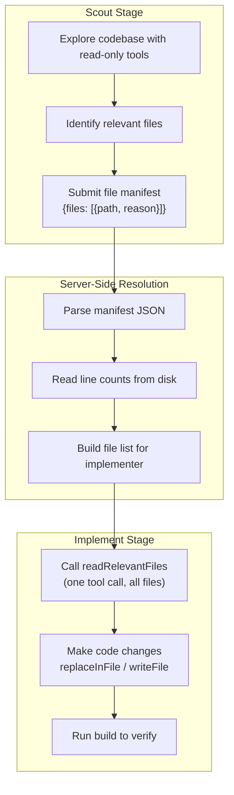

# Pipeline Stages

## Stage Flow

```mermaid
graph LR
    Scout["🔍 Scout\n(read-only)"]
    Implement["⚙️ Implement\n(read + write)"]
    TestWrite["🧪 Test-Write\n(write tests only)"]
    Review["📋 Review\n(read-only + run)"]
    GitOps["🚀 GitOps\n(commit + push + PR)"]

    Scout -->|file manifest| Implement
    Implement -->|code changes| TestWrite
    TestWrite -->|test results| Review
    Review -->|accept| NextLens{More lenses?}
    Review -->|reject| Implement
    NextLens -->|yes| Review
    NextLens -->|no| GitOps

    style Scout fill:#1e3a5f
    style Implement fill:#1e3a5f
    style TestWrite fill:#1e3a5f
    style Review fill:#1e3a5f
    style GitOps fill:#1e3a5f
```

## What Each Stage Sees and Does

## Stage Details

| Stage | Access | Tools | Purpose |
|-------|--------|-------|---------|
| **Scout** | Read-only | readFile, searchFiles, listDirectory, getFileInfo, saveCheckpoint | Find all files relevant to the issue |
| **Implement** | Read + Write | All filesystem tools + readRelevantFiles | Read files and make code changes |
| **Test-Write** | Read + Write (tests only) | readFile, searchFiles, writeFile, runCommand | Write and run tests for the changes |
| **Review** | Read + Run | readFile, searchFiles, runCommand, gitStatus, gitDiff | Review the implementation through focused lenses |
| **GitOps** | Git operations | (internal) | Create GitHub issue, commit, push, create PR |
