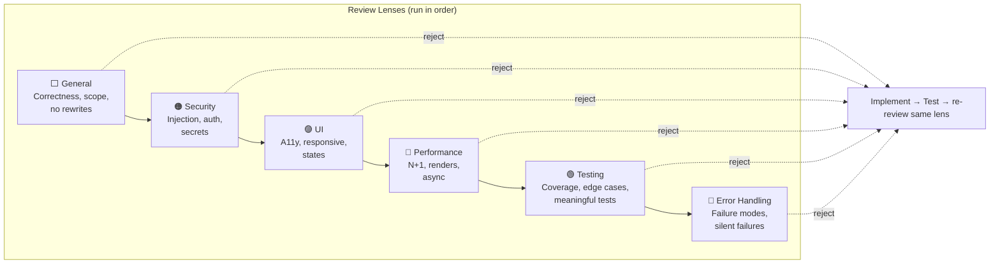

# Review Lenses

Review lenses are focused review passes that run sequentially after implementation. Each lens examines the code through a specific concern. If any lens rejects, the implementation loops back for fixes before continuing.

## Lens Flow

## Available Lenses

| Lens | Color | Focus |
|------|-------|-------|
| **General** | White | Correctness, completeness, scope. Rejects rewrites, signature changes, over-scoped changes. Always included. |
| **Security** | Orange | Input validation, auth, secrets, injection, SSRF, path traversal |
| **UI** | Purple | Visual consistency, responsive layout, a11y, loading/error/empty states |
| **Performance** | Cyan | Re-renders, N+1 queries, unbounded loops, bundle size, async operations |
| **Testing** | Green | Test quality — meaningful tests, edge cases, isolation, can tests pass while feature is broken? |
| **Error Handling** | Red | Failure modes, silent failures, error messages, partial failure consistency, timeouts |

## How Lenses Are Selected

- **Always**: `general` is always included
- **Planner**: The AI planner recommends lenses based on the issue scope
- **Manual**: User can toggle lenses on/off via chips in the issue detail view (pending issues only)
- **Storage**: Lenses are stored as a JSON array on the issue: `review_lenses: '["general","security"]'`

## Retry Budget

Each lens gets its own retry budget (MAX_RETRIES = 3). If a lens exhausts retries, the pipeline advances to the next lens rather than blocking. Retry count resets when advancing to a new lens.
