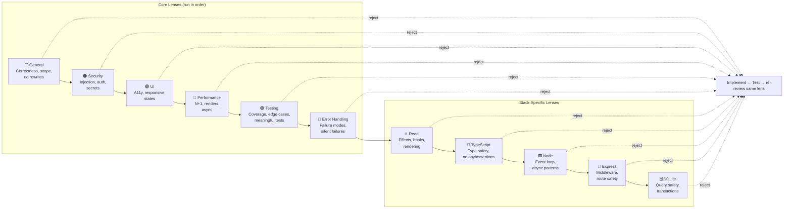

# Review Lenses

Review lenses are focused review passes that run sequentially after implementation. Each lens examines the code through a specific concern. If any lens rejects, the implementation loops back for fixes before continuing.

## Lens Flow

## Available Lenses

### Core Lenses

| Lens | Focus |
|------|-------|
| **General** | Correctness, completeness, scope. Rejects rewrites, signature changes, over-scoped changes, dead code, behavioral regression, collateral damage. Always included. |
| **Security** | Input validation, auth, secrets, deserialization, dependency vulnerabilities, injection, SSRF, path traversal |
| **UI** | Visual consistency, responsive layout, a11y (labels, alt text, keyboard nav, focus management), loading/error/empty states, duplicate controls |
| **Performance** | Re-renders, N+1 queries, unbounded loops, bundle size, async operations |
| **Testing** | Behavior vs implementation testing, mock fidelity, silent pass anti-patterns, coverage gaps, edge cases |
| **Error Handling** | Failure modes, error catching levels, error context, silent failures, partial failure consistency, timeouts |

### Stack-Specific Lenses

| Lens | Focus |
|------|-------|
| **React** | Effect misuse (missing deps, effects for derived state), component design (prop drilling, render props), hooks rules, rendering (keys, memoization) |
| **TypeScript** | Type safety (reject `any`, type assertions, `!` operator), type design (unions over booleans, branded types), runtime safety (JSON.parse validation) |
| **Node** | Event loop safety (no sync I/O in request handlers), async patterns (unhandled rejections, proper cleanup), resource management, process safety |
| **Express** | Middleware ordering, async route handler error propagation, request validation, response safety (no secrets in responses), performance |
| **SQLite** | Query safety (no string concatenation), transactions for multi-statement ops, index usage, migration safety (additive only), concurrency (WAL mode) |

## Cache-Friendly Prompt Structure

Reviews use a three-part prompt to maximize token caching across lenses:

```mermaid
graph TD
    subgraph Prompt["Review Prompt (per lens)"]
        S["1. System Prompt\n(identical across all lenses)\n→ CACHED"]
        C["2. Shared Context\n(git diff, project files, prior outputs)\n→ CACHED"]
        L["3. Lens Prompt\n(lens-specific instructions + REJECT criteria)\n→ Only this changes"]
    end

    S --> C --> L

    style S fill:#2d4a22
    style C fill:#2d4a22
    style L fill:#1e3a5f
```

This structure gives **~77% token savings** when running multiple lenses on the same change, since parts 1 and 2 are identical and cached by the LLM provider.

## How Lenses Are Selected

- **Always**: `general` is always included
- **Planner**: The AI planner recommends lenses based on the issue scope
- **Manual**: User can toggle lenses on/off via chips in the issue detail view (pending issues only)
- **Storage**: Lenses are stored as a JSON array on the issue: `review_lenses: '["general","security","typescript"]'`

## Retry Budget

Each lens gets its own retry budget (MAX_RETRIES = 3). If a lens exhausts retries, the pipeline advances to the next lens rather than blocking. Retry count resets when advancing to a new lens.
