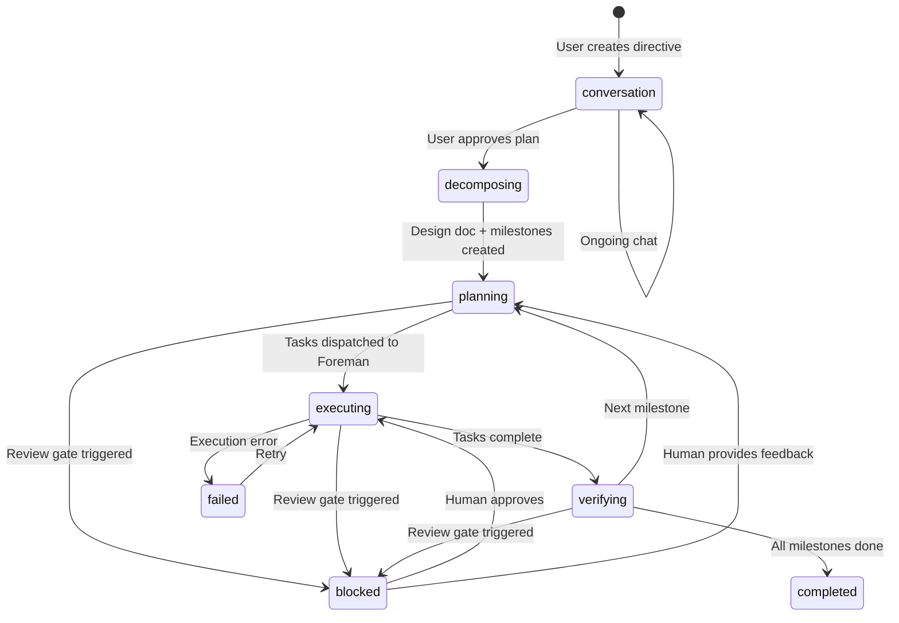
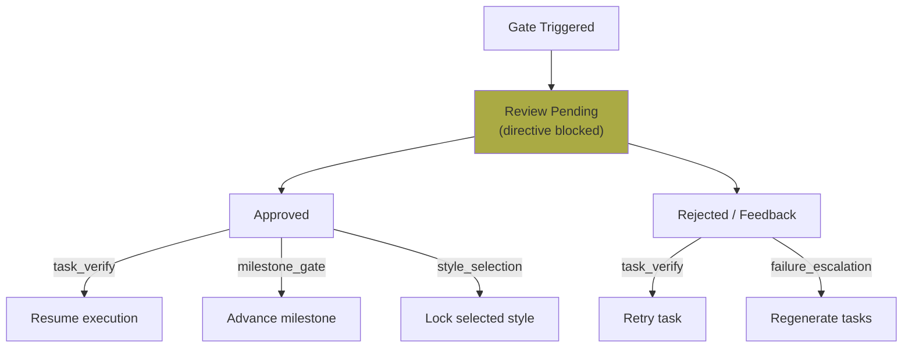
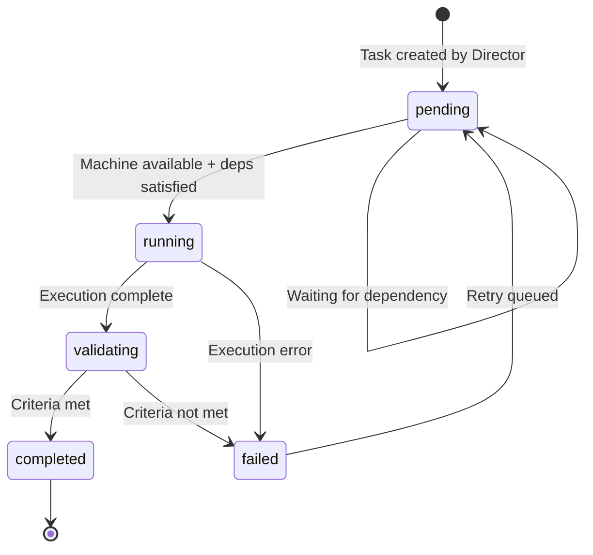
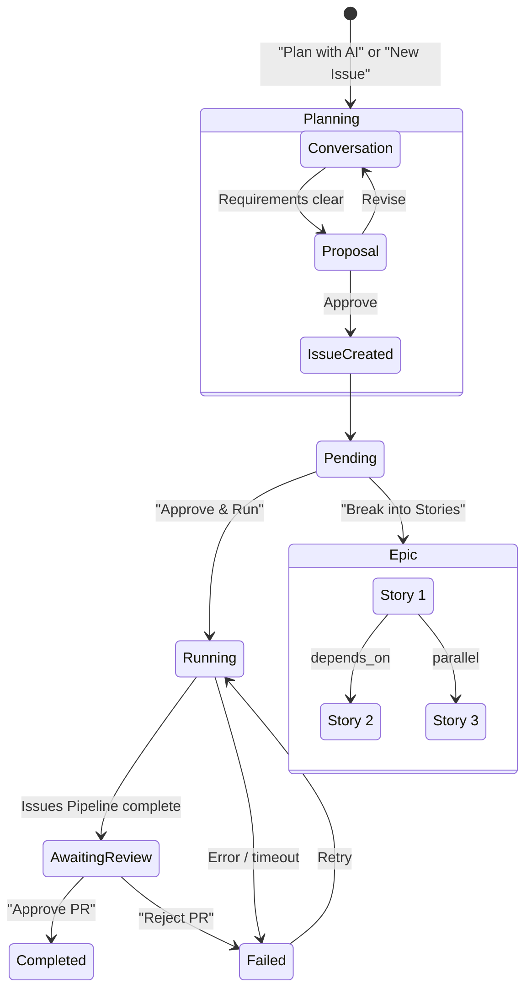
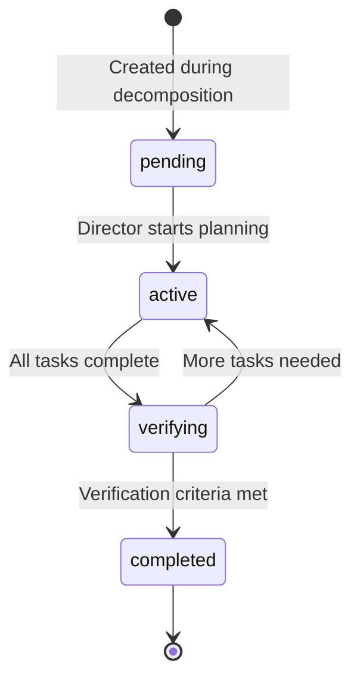

# Issue & Directive Lifecycle

This document covers the lifecycle of all work items in the system: directives (high-level goals), foreman tasks (units of work), and issues (pipeline-based work items).

## Directive Lifecycle

### Directive Statuses

| Status | Meaning |
|--------|---------|
| `conversation` | Director chatting with user, researching, refining plan |
| `decomposing` | Generating design document and milestones |
| `planning` | Generating task batches for current milestone |
| `executing` | Foreman tasks running |
| `verifying` | Director reviewing completed tasks and milestone criteria |
| `blocked` | Waiting for human decision at a review gate |
| `completed` | All milestones verified |
| `failed` | Unrecoverable error |

### Autonomy Levels

Directives have an autonomy level that controls how often human review gates trigger:

| Level | Behavior |
|-------|----------|
| **Conservative** | All gates trigger — task verification, design choices, milestones, failures, style |
| **Standard** | Skips design change gates — trusts Director's architectural decisions |
| **Aggressive** | Also skips milestone completion gates — only pauses for task verification, failures, and style |

## Review Gates

Review gates are human-in-the-loop checkpoints that pause a directive until resolved.

### Gate Types

| Type | Trigger | Possible Responses |
|------|---------|-------------------|
| `task_verify` | Task completed, needs human check | approve, reject (retry task) |
| `design_choice` | Director needs architectural decision | approve, provide feedback |
| `milestone_gate` | Milestone complete | approve (advance), feedback (adjust) |
| `failure_escalation` | Task failed repeatedly | approve (skip), regenerate tasks |
| `style_selection` | Style exploration results ready | select style (lock), reject all (re-explore), enhance (img2img) |

Art review gates don't block code task planning — only the art pipeline pauses.

## Foreman Task Lifecycle

### Foreman Task Statuses

| Status | Meaning |
|--------|---------|
| `pending` | Waiting for machine availability and dependency resolution |
| `running` | Executing on a machine (code in worktree, or ComfyUI workflow) |
| `validating` | Checking acceptance criteria |
| `completed` | Successfully finished |
| `failed` | Execution or validation failed (may retry) |

### Task Types

| Type | Machine | Execution |
|------|---------|-----------|
| `code` | Inference | LLM agent in git worktree with filesystem tools |
| `review` | Inference | LLM reviews code changes |
| `content` | Inference | LLM generates documentation/text |
| `claude` | Inference | General-purpose LLM task |
| `art` | ComfyUI | Image generation via preset workflows |
| `music` | ComfyUI | Music generation (ACE-Step) |
| `sfx` | ComfyUI | Sound effect generation (AudioGen) |
| `style_exploration` | ComfyUI | Style discovery (6 varied prompts) |

### Task Dependencies

Tasks can declare `depends_on` (JSON array of task IDs). The Foreman scheduler only dispatches a task when all dependencies are `completed`.

## Issue Lifecycle (Issues Pipeline)

### Issue Statuses

| Status | Meaning | User Actions |
|--------|---------|-------------|
| `pending` | Created, waiting for approval | Approve & Run, Break into Stories, edit lenses |
| `approved` | Approved, waiting for machine | (automatic transition) |
| `running` | Issues Pipeline is executing | Cancel |
| `awaiting_review` | PR created, waiting for human | Approve PR, Reject PR, View Diff |
| `completed` | PR merged | (terminal) |
| `failed` | Issues Pipeline or PR rejected | Retry All, Resume from Checkpoint |
| `epic` | Container for child stories | View stories |

### Epic Decomposition

Epics are issues with `status: "epic"` that contain child issues. Each child has:
- `parent_id` — points to the epic
- `sequence` — display order
- `depends_on` — JSON array of sibling issue IDs that must complete first

Epics can be created two ways:
1. **Planner produces `epic_proposal`** — automatically creates epic + stories
2. **"Break into Stories" button** — sends existing issue to LLM for decomposition, converts it to an epic

Epic status is derived from children in the UI (not stored):
- All completed → completed
- Any failed → failed
- Any running → running
- Otherwise → pending

## Milestone Lifecycle

Milestones are sequenced within a directive. The Director advances to the next milestone only after verifying the current one. Each milestone has:
- `sequence` — execution order
- `verification_criteria` — what must be true for completion
- `status` — pending, active, completed
