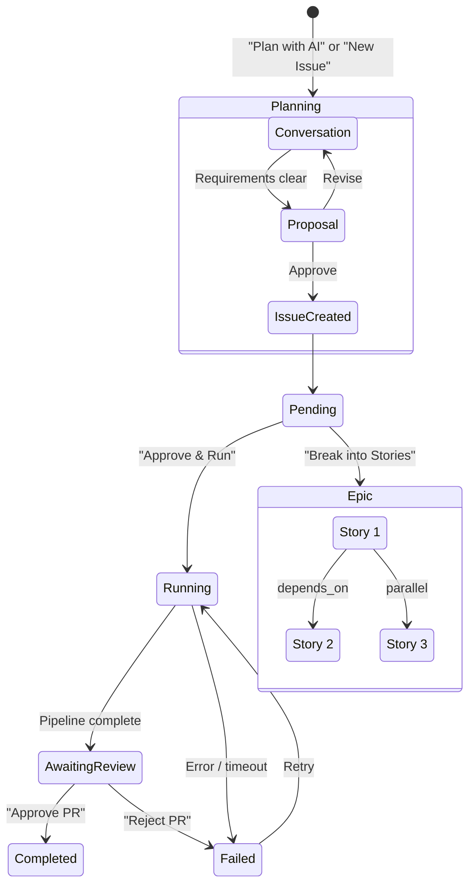

# Issue Lifecycle

## State Machine

## Issue Statuses

| Status | Meaning | User Actions |
|--------|---------|-------------|
| `pending` | Created, waiting for approval | Approve & Run, Break into Stories, edit lenses |
| `approved` | Approved, waiting for machine | (automatic transition) |
| `running` | Pipeline is executing | Cancel |
| `awaiting_review` | PR created, waiting for human | Approve PR, Reject PR, View Diff |
| `completed` | PR merged | (terminal) |
| `failed` | Pipeline or PR rejected | Retry All, Resume from Checkpoint |
| `epic` | Container for child stories | View stories |

## Epic Decomposition

Epics are issues with `status: "epic"` that contain child issues. Each child has:
- `parent_id` — points to the epic
- `sequence` — display order
- `depends_on` — JSON array of sibling issue IDs that must complete first

Epics can be created two ways:
1. **Planner produces `epic_proposal`** — automatically creates epic + stories
2. **"Break into Stories" button** — sends existing issue to LLM for decomposition, converts it to an epic

Epic status is derived from children in the UI (not stored):
- All completed → completed
- Any failed → failed
- Any running → running
- Otherwise → pending
