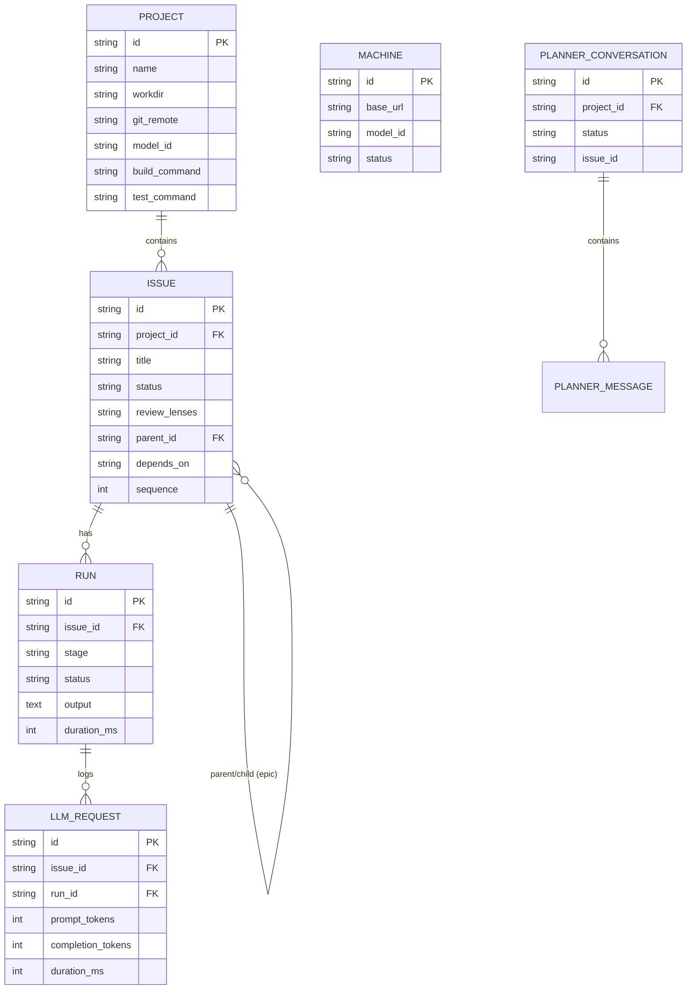

# Data Model

## Tables

| Table | Purpose |
|-------|---------|
| `machines` | LLM server endpoints (base_url, model_id, status, context_limit) |
| `projects` | Git repos to work on (workdir, remote, default branch, build/test commands) |
| `issues` | Work items — standalone, epic parents, or epic children |
| `runs` | One per pipeline stage execution (scout, implement, build_gate, test_write, test_gate, review:lens, git_ops) |
| `llm_requests` | Per-step LLM call logs with token counts and duration |
| `planner_conversations` | Interactive planning sessions |
| `planner_messages` | Messages within planning conversations |

## Key Relationships

- **Machine → Issue**: A machine works on one issue at a time (`status: "working"`, `current_run_id`)
- **Issue → Issue**: Epic parent/child via `parent_id`. Dependencies via `depends_on` (JSON array of issue IDs)
- **Issue → Run**: Multiple runs per issue (one per stage, plus retries)
- **Run → LLM Request**: Multiple LLM calls per run (one per agent step)
- **Planner Conversation → Issue**: A conversation produces an issue on approval (`issue_id`)
