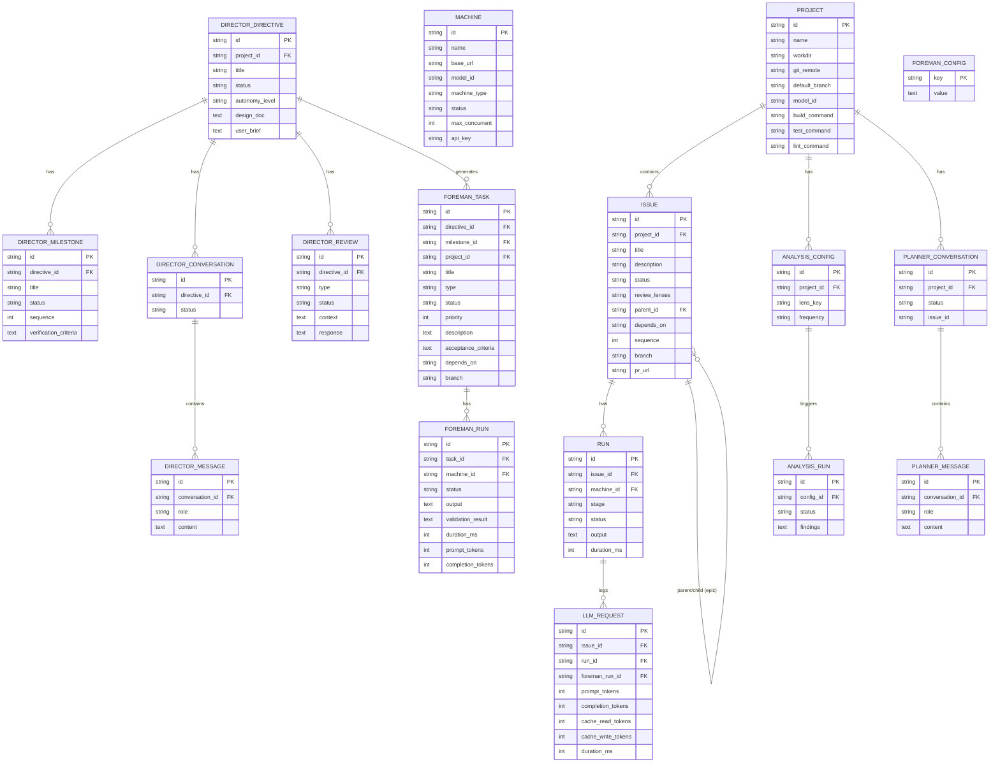

# Data Model

SQLite database with WAL mode. Drizzle ORM for schema, raw SQL for complex queries. Migrations in `db.ts` `migrate()` method.

## Entity Relationships

## Table Groups

### Core Tables

| Table | Purpose |
|-------|---------|
| `machines` | LLM/ComfyUI server endpoints. Fields: base_url, model_id, machine_type (`inference`/`comfyui`), status, max_concurrent, api_key |
| `projects` | Git repos to work on. Fields: workdir, git_remote, default_branch, build/test/lint commands, model_id override |
| `issues` | Issues Pipeline work items — standalone, epic parents, or epic children. Fields: status, review_lenses, parent_id, depends_on, branch, pr_url |
| `runs` | Issues Pipeline stage executions (scout, implement, build_gate, test_write, test_gate, review:lens, git_ops). Token tracking per run |
| `llm_requests` | Per-step LLM call audit log with prompt/completion/cache token counts and duration |

### Director Tables

| Table | Purpose |
|-------|---------|
| `director_directives` | Top-level goals with autonomy_level (conservative/standard/aggressive), status, design_doc, milestone tracking |
| `director_milestones` | Sequenced phases within directives, each with verification_criteria and status |
| `director_reviews` | Human-in-the-loop review gates. Types: task_verify, design_choice, milestone_gate, failure_escalation, style_selection |
| `director_conversations` | Conversation sessions per directive |
| `director_messages` | Individual messages within conversations |

### Foreman Tables

| Table | Purpose |
|-------|---------|
| `foreman_tasks` | Work units queued for execution. Types: code, art, music, sfx, style_exploration, review, content, claude. Fields: priority, depends_on, acceptance_criteria, branch |
| `foreman_runs` | Execution attempts per task with output, validation_result, token usage |
| `foreman_config` | Global settings: enabled, tasks_dir, priority_mode, tick_interval, director_reserved_machine, analysis toggle, continuous_exploration |

### Planning & Analysis Tables

| Table | Purpose |
|-------|---------|
| `planner_conversations` | Interactive planning sessions for issues |
| `planner_messages` | Messages within planning conversations |
| `analysis_configs` | Per-project, per-lens analysis configuration with frequency |
| `analysis_runs` | Analysis execution results with findings |

## Key Relationships

- **Machine → Foreman Task**: A machine works on tasks via leases managed by Machine Manager
- **Directive → Milestone**: Sequenced 1:N, milestones advance in order
- **Directive → Foreman Task**: Director generates tasks during planning phases
- **Directive → Review**: Gates created at decision points, pause the directive
- **Foreman Task → Foreman Run**: Multiple execution attempts per task
- **Issue → Issue**: Epic parent/child via `parent_id`. Dependencies via `depends_on` (JSON array)
- **Issue → Run**: Multiple runs per issue (one per pipeline stage, plus retries)
- **Run → LLM Request**: Multiple LLM calls per run (one per agent step)
- **LLM Request → Foreman Run**: LLM calls also tracked for foreman executions via `foreman_run_id`
