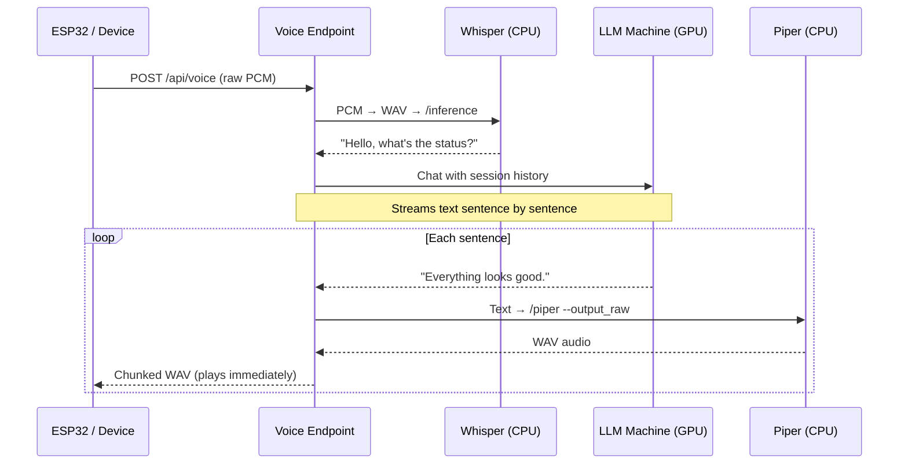

# Voice Pipeline

The voice endpoint provides a speech-to-speech interface for an ESP32/M5 StickC device. It's a general-purpose voice assistant, not tied to the issue pipeline.

## Sequence

## Architecture

| Component | Runs On | Purpose |
|-----------|---------|---------|
| Whisper.cpp | CPU (server) | Speech-to-text — systemd service on port 8080 |
| LLM | GPU (llama.cpp machine) | Text generation — shared with pipeline |
| Piper | CPU (server, CLI) | Text-to-speech — spawned per sentence |

## Audio Format

- **Input**: Raw 16-bit signed PCM, mono, 16kHz, little-endian
- **Output**: WAV per sentence (chunked transfer for streaming playback)

## Session Management

- Sessions tracked in-memory via `X-Session-Id` header
- Multi-turn conversation history maintained per session
- Auto-expire after 30 minutes of inactivity
- Max 50 messages per session (oldest trimmed)
- Concurrent request protection per session

## Configuration (env vars)

| Variable | Purpose |
|----------|---------|
| `STT_URL` | Whisper server URL |
| `VOICE_LLM_URL` | LLM server URL |
| `VOICE_MODEL_ID` | Model ID on the LLM server |
| `PIPER_PATH` | Path to piper executable |
| `PIPER_MODEL` | Path to .onnx voice model |
| `VOICE_SYSTEM_PROMPT` | Custom personality prompt |
