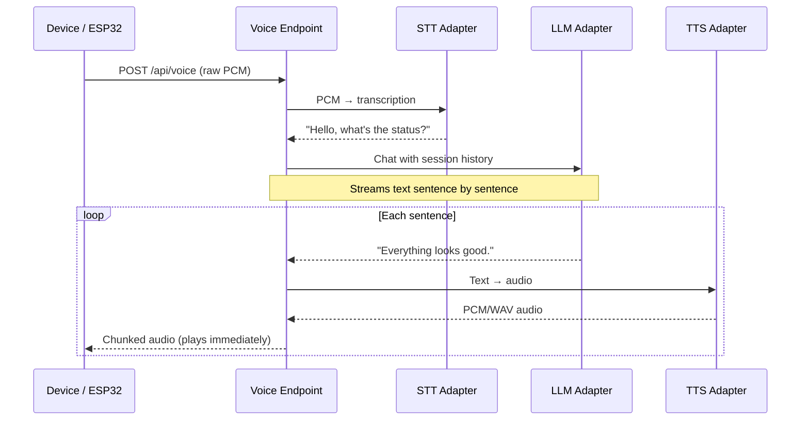

# Voice Pipeline

The voice endpoint provides a speech-to-speech interface for an ESP32/M5 StickC device (or any HTTP client). It's a general-purpose voice assistant, not tied to the issue pipeline.

## Sequence



## Architecture

The voice pipeline uses a pluggable adapter pattern. Each component (STT, LLM, TTS) is an interface that can be backed by different implementations:

| Component | Adapter | Implementation |
|-----------|---------|---------------|
| **STT** | `SttAdapter` | `stt-llamacpp.ts` — Whisper via llama.cpp server |
| **LLM** | `LlmAdapter` | `llm-llamacpp.ts` — llama.cpp chat completions |
| **TTS** | `TtsAdapter` | `tts-piper.ts` — Piper CLI (spawned per sentence) |
| | | `tts-llamacpp.ts` — llama.cpp TTS endpoint |

## Audio Format

- **Input**: Raw 16-bit signed PCM, mono, 16kHz, little-endian
- **Output**: WAV per sentence (chunked transfer for streaming playback)

## Session Management

- Sessions tracked in-memory via `X-Session-Id` header
- Multi-turn conversation history maintained per session
- Auto-expire after 30 minutes of inactivity
- Max 50 messages per session (oldest trimmed)
- Concurrent request protection per session

## Configuration (env vars)

| Variable | Purpose |
|----------|---------|
| `STT_URL` | Whisper/STT server URL |
| `VOICE_LLM_URL` | LLM server URL |
| `VOICE_MODEL_ID` | Model ID on the LLM server |
| `PIPER_PATH` | Path to piper executable |
| `PIPER_MODEL` | Path to .onnx voice model |
| `VOICE_SYSTEM_PROMPT` | Custom personality prompt |

## Voice Files

```
src/server/voice/
├── index.ts          # Express router, orchestrates STT → LLM → TTS
├── types.ts          # SttAdapter, LlmAdapter, TtsAdapter interfaces
├── sessions.ts       # In-memory session management
├── stt-llamacpp.ts   # Whisper STT via llama.cpp
├── llm-llamacpp.ts   # LLM via llama.cpp
├── tts-piper.ts      # Piper TTS (CLI, spawned per sentence)
├── tts-llamacpp.ts   # llama.cpp TTS endpoint
├── wav.ts            # WAV header utilities
└── wav.test.ts       # WAV tests
```
