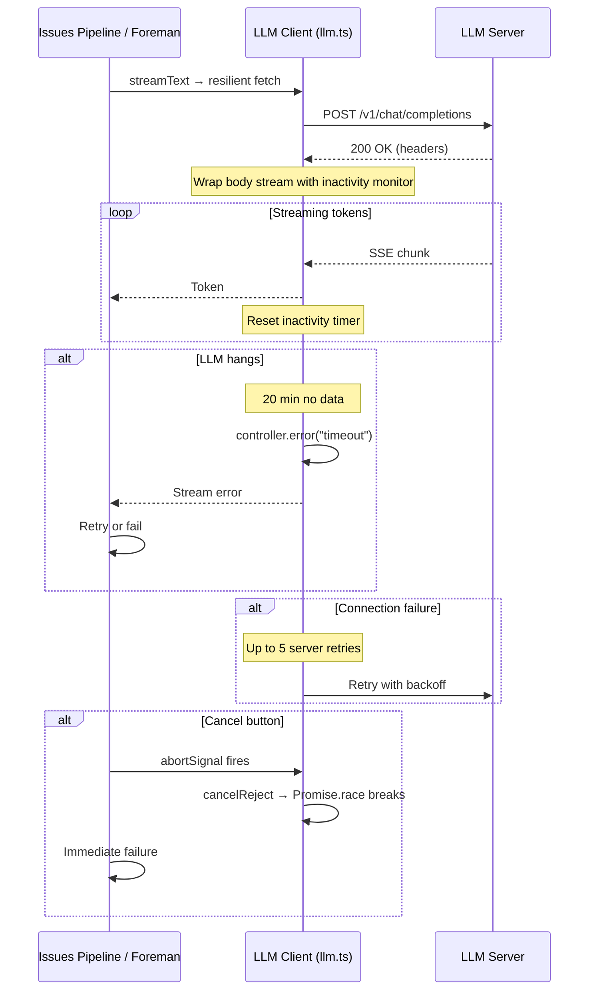
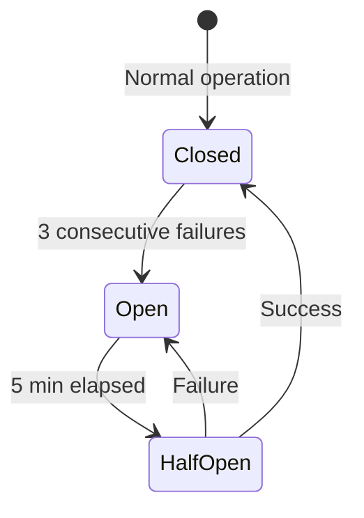
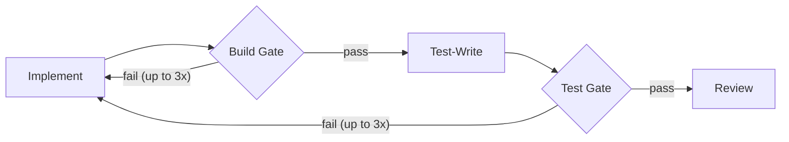

# Resilience & Timeout Architecture

## Per-Request Stream Monitoring

## Timeout Layers

| Layer | Timeout | What it protects against |
|-------|---------|------------------------|
| **Connection timeout** | 10 minutes | Initial connection to LLM server fails or hangs |
| **Stream inactivity monitor** | 20 minutes | LLM connection hangs mid-stream (no data arriving) |
| **Stage hard timeout** | 15 minutes | Issues Pipeline stage runs forever (infinite tool call loops) |
| **Cancel button** | Immediate | User wants to stop — `Promise.race` rejection breaks out |

## LLM Client Resilience (llm.ts)

The unified LLM client (`llm.ts`) provides:

- **Resilient fetch** — custom fetch wrapper with API key injection, connection timeout, and retry logic
- **Server retries** — up to 5 retries on connection failures with backoff
- **AI SDK retries** — up to 6 retries at the AI SDK level
- **Stream monitoring** — 20-minute inactivity timeout per chunk
- **Prompt caching hints** — compatible with Anthropic and OpenRouter cache control

## How Cancel Works

The cancel button sets an `AbortController.abort()`. This:
1. Fires the abort signal on `streamText` (best effort — may not respond if stream is hung)
2. Rejects `cancelPromise` in `Promise.race` — **guaranteed** to break out immediately
3. Stage catch block marks the run as failed
4. Issues Pipeline / Foreman finally block releases the machine and cleans up the worktree

## Circuit Breaker (Foreman)

Per-machine circuit breakers prevent repeated dispatch to failing machines:

| State | Behavior |
|-------|----------|
| **Closed** | Normal — tasks dispatched freely |
| **Open** | Blocked — no tasks dispatched to this machine |
| **Half-Open** | Trial — one task allowed; success → closed, failure → open |

Configuration: `failureThreshold = 3`, `resetTimeoutMs = 5 minutes`.

## Machine Manager & Lease Expiry

All machine access goes through the lease system (`machine-manager.ts`),
fronted by the public dispatch helpers in `llm-dispatch.ts` (`withLlmSession`,
`withLightLlmSession`, `withLightOrFallbackLlmSession`):

- **Idle timeouts**: 10 min Director, 30 min Foreman, 60 min Issues Pipeline, 10 min Analysis
- **Auto-renewal**: agent loops call `renewLease(leaseId)` on every step,
  so a healthy in-progress task never expires. The timeout is an *idle*
  timeout, not a wall-clock cap.
- **Abort on expiry**: callers register `setLeaseOnExpiry(leaseId, () => abortController.abort())`
  so a hung LLM call (e.g. server returns 200 then never sends a token)
  is forcibly aborted when the lease expires, instead of dangling forever.
- **Priority queuing**: Director gets priority over Foreman for machine acquisition.
- **Startup cleanup**: `clearAllLeases()` on orchestrator start — prevents stale leases from crashed sessions.
- **Director reservation**: Orchestrator prevents Foreman from dispatching to the Director's reserved machine.

## Agent Loop Stall Detection

The agent loop runner in `pipeline/run-stage.ts` watches for several
categorical stall patterns and aborts the in-flight stream when they fire,
so a runaway agent can't burn an entire lease window:

- **Wall-clock timeout** — hard cap on a single stage / task, regardless of activity.
- **Repeated tool-call loop guard** (`tool-loop-guard.ts`) — exact-match
  detection on `(tool_name, args_hash)`. If the agent calls the same tool
  with the same arguments N times in a row, abort.
- **Categorical-stall detector** — two streak counters:
  - **No-write streak**: consecutive non-`writeFile` / non-`replaceInFile`
    steps. If the agent reads / searches / runs commands for ~30 steps
    without ever writing code, it's investigating forever and gets aborted.
  - **runCommand burn streak**: consecutive `runCommand` calls running
    inspection-only utilities (`sed`, `head`, `tail`, `cat`, `wc`, `ls`,
    `find`, `grep`, `file`, `xxd`, `od`, `md5sum`, `stat`, `godot --check-only`).
    If the agent burns ~25 calls just poking at files via the shell, abort.
- **Compaction / context expansion abort propagation** — when context
  compaction or file-expansion logic decides the loop must stop, the abort
  is propagated unconditionally to the underlying stream.

All abort paths flow through a single `AbortController` so the LLM stream,
the tool runner, and the lease auto-renewal loop all tear down together.

## Build & Test Gates

Gates are server-side checks (no LLM calls):
- **Only run when configured** — project must have `build_command` / `test_command` set in Settings
- Run the command, extract error messages, return "success" or errors
- On failure: errors are sent to the implement stage as `## BUILD FAILING` or `## TESTS FAILING`
- Up to 3 retries per gate — then proceed anyway
- Implement clears old errors on each re-run (no stale error accumulation)

## Crash Recovery

### Orchestrator Startup

On server startup, `startOrchestrator()`:
1. `clearAllLeases()` — removes all stale leases from previous session
2. Starts stats collector, analysis scheduler
3. Starts Director scheduler (gets first tick)
4. Starts Foreman scheduler (gated until Director's first tick completes)
5. `cleanupWorktrees()` — removes stale worktrees from failed/completed foreman tasks

### Issues Pipeline Recovery

`recoverFromCrash()` resets:
- Machines stuck in `"working"` → `"idle"`
- Runs stuck in `"running"` → `"fail"`
- Issues stuck in `"running"` or `"approved"` → `"failed"`

## Coding Standards (enforced by prompts + review)

The implement stage and general review lens enforce:
- **Additive changes only** — never rewrite existing files
- **No signature changes** — unless the issue specifically requires it
- **`replaceInFile` for edits** — `writeFile` only for new files
- **Build verification** — call `checkBuild` after changes
- **General review REJECT rules** — rejects rewrites, restructuring, signature changes, over-scoped changes

## Scout Safeguards

- Empty or insufficient manifest (<10 chars) throws — pipeline fails rather than sending blind implementer
- Manifest with no valid files throws
- Path traversal in manifest file paths is blocked

## Tool Safeguards

| Tool | Protection |
|------|-----------|
| `readFile` | Path validation — can't read outside worktree |
| `writeFile` | Path validation — can't write outside worktree |
| `replaceInFile` | Must match exactly once — rejects ambiguous edits. Fallback: strips line number prefixes, normalizes indentation |
| `runCommand` | 60-second timeout, runs in worktree cwd only |
| `readRelevantFiles` | Path traversal check per file in manifest |
| `lookupDocs` | 15-second timeout on Context7 API calls |
| `checkBuild` / `checkTests` | 120-second timeout, error extraction filters noise |
