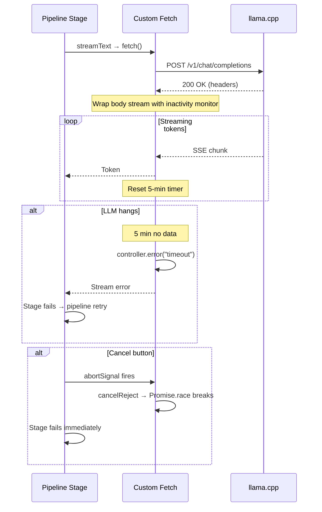
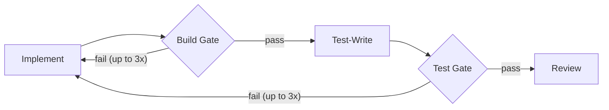

# Resilience & Timeout Architecture

## Per-Request Stream Monitoring

## Timeout Layers

| Layer | Timeout | What it protects against |
|-------|---------|------------------------|
| **Per-chunk stream monitor** | 5 minutes | LLM connection hangs mid-stream (no data arriving) |
| **Stage hard timeout** | 15 minutes | Stage runs forever (infinite tool call loops, etc.) |
| **Cancel button** | Immediate | User wants to stop — `Promise.race` rejection breaks out of hung `for await` |

## How Cancel Works

The cancel button sets an `AbortController.abort()`. This:
1. Fires the abort signal on `streamText` (best effort — may not respond if stream is hung)
2. Rejects `cancelPromise` in `Promise.race` — **guaranteed** to break out immediately
3. Stage catch block marks the run as failed
4. Pipeline finally block releases the machine and cleans up the worktree

## Build & Test Gates

Gates are server-side checks (no LLM calls):
- **Only run when configured** — project must have `build_command` / `test_command` set in Settings
- Run the command, extract error messages, return "success" or errors
- On failure: errors are sent to the implement stage as `## BUILD FAILING` or `## TESTS FAILING`
- Up to 3 retries per gate — then proceed anyway
- Implement clears old errors on each re-run (no stale error accumulation)

## Crash Recovery

On server startup, `recoverFromCrash()` resets:
- Machines stuck in `"working"` → `"idle"`
- Runs stuck in `"running"` → `"fail"`
- Issues stuck in `"running"` or `"approved"` → `"failed"`

## Coding Standards (enforced by prompts + review)

The implement stage and general review lens enforce:
- **Additive changes only** — never rewrite existing files
- **No signature changes** — unless the issue specifically requires it
- **`replaceInFile` for edits** — `writeFile` only for new files
- **Build verification** — call `checkBuild` after changes
- **General review REJECT rules** — rejects rewrites, restructuring, signature changes, over-scoped changes

## Scout Safeguards

- Empty or insufficient manifest (<10 chars) throws — pipeline fails rather than sending blind implementer
- Manifest with no valid files throws
- Path traversal in manifest file paths is blocked

## Tool Safeguards

| Tool | Protection |
|------|-----------|
| `readFile` | Path validation — can't read outside worktree |
| `writeFile` | Path validation — can't write outside worktree |
| `replaceInFile` | Must match exactly once — rejects ambiguous edits. Fallback: strips line number prefixes, normalizes indentation |
| `runCommand` | 60-second timeout, runs in worktree cwd only |
| `readRelevantFiles` | Path traversal check per file in manifest |
| `lookupDocs` | 15-second timeout on Context7 API calls |
| `checkBuild` / `checkTests` | 120-second timeout, error extraction filters noise |
