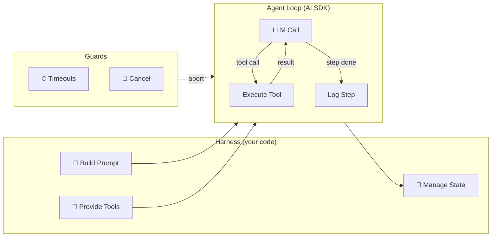
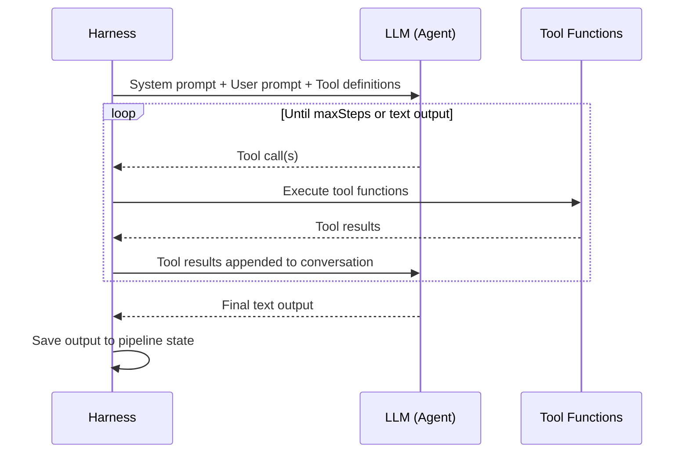
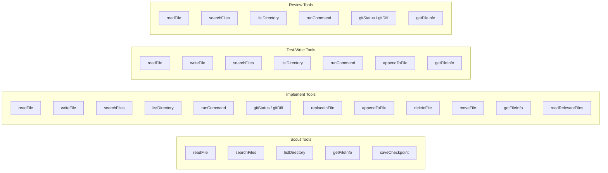
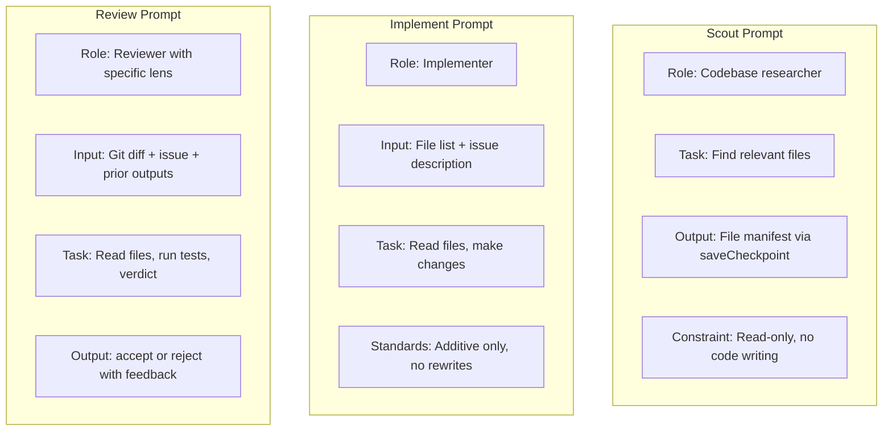
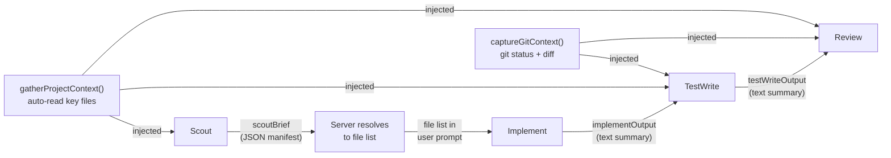
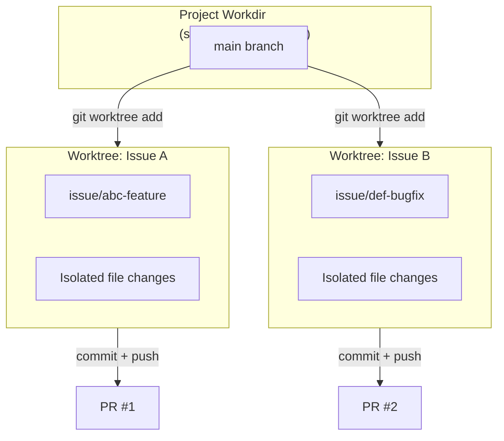
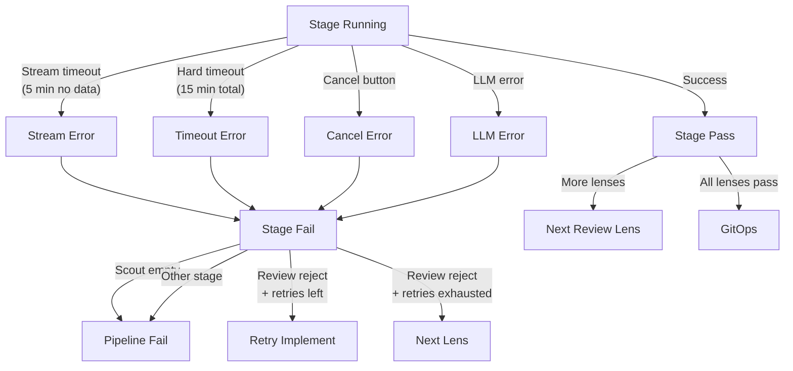

# Agent Harness

The harness is the infrastructure that runs LLM agents — managing their tools, context, prompts, and lifecycle. The agents themselves are stateless LLM calls; the harness provides everything around them.

## What the Harness Does

The harness wraps each pipeline stage. It builds the prompt, hands the LLM a set of tools, runs the agent loop, logs each step, and enforces timeouts. The LLM itself is stateless — it just receives a prompt and responds with text or tool calls.

## Agent vs Harness Responsibilities

| Concern | Agent (LLM) | Harness (Code) |
|---------|-------------|----------------|
| **What to do** | Decides based on prompt + tools | Provides the issue description and file list |
| **How to do it** | Generates tool calls and code | Executes tool calls, returns results |
| **What tools exist** | Sees tool names + descriptions | Creates tool functions, controls which are available per stage |
| **File access** | Calls readFile/writeFile | Reads from worktree, enforces path boundaries |
| **Context window** | Manages within its limit | Controls prompt size, provides pre-loaded project files |
| **When to stop** | Produces result block | Enforces step limits, timeouts, abort signals |
| **Quality** | Follows coding standards in prompt | Review lenses catch violations |
| **State between stages** | None — each stage is a fresh context | LangGraph persists state, passes outputs between nodes |

## The Agent Loop

Each stage runs one agent loop via `streamText`:

Key points:
- The LLM has **no memory between stages** — each stage starts with a fresh system prompt and user message
- Tool calls and results accumulate **within** a stage (the AI SDK manages the conversation)
- The harness controls **which tools** each stage can access — scout gets read-only, implement gets read+write, review gets read+run
- **`onStepFinish`** fires after each tool call round-trip, allowing the harness to log progress

## Tool Provisioning Per Stage

The harness creates different tool sets per stage to enforce boundaries:

## Prompt Strategy

Each stage gets a focused prompt. The harness doesn't use a shared "mega-prompt" — each stage sees only what's relevant:

## Data Flow Between Stages

Stages don't share context directly — the harness passes data through pipeline state:

Note: `implementOutput` and `testWriteOutput` are only the LLM's **text** responses — not the full tool call history. The actual code changes live in the worktree (visible via `gitDiff`).

## Isolation Model

Each issue gets its own git worktree — a lightweight checkout of the repo on a separate branch. This means:
- Multiple issues can run concurrently without conflicts
- Each agent sees a clean copy of the codebase
- Changes are isolated until the PR is merged
- Worktrees are cleaned up after the pipeline finishes (success or failure)

## Error Handling

