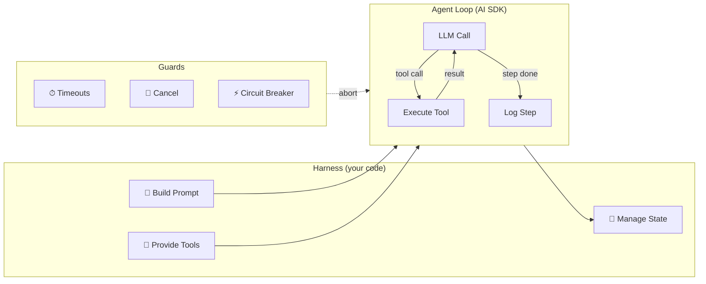
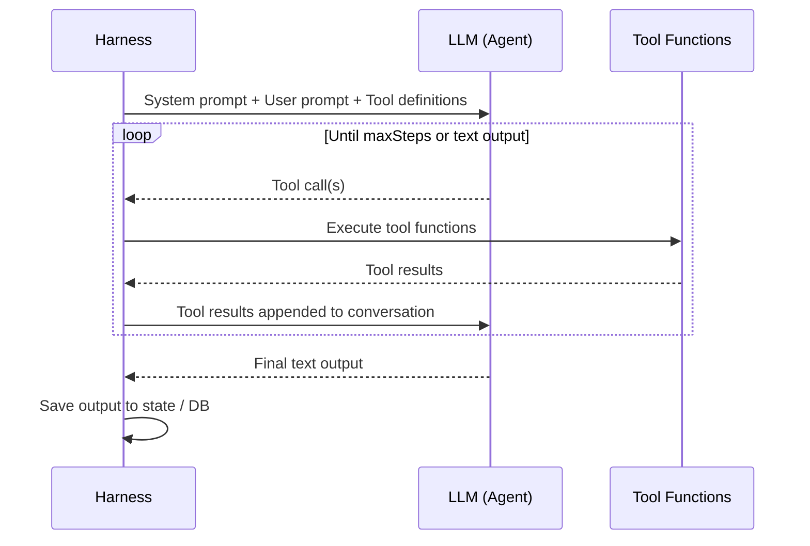
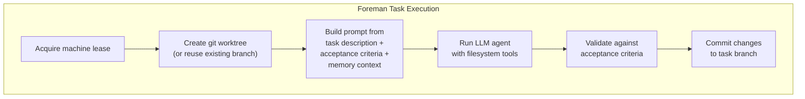
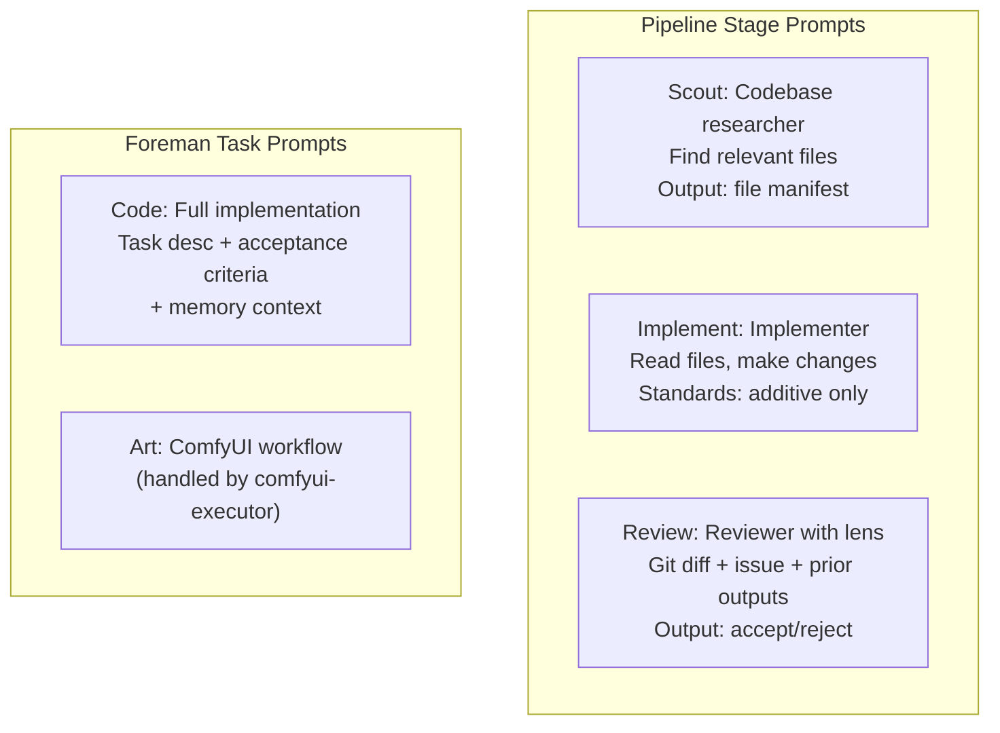
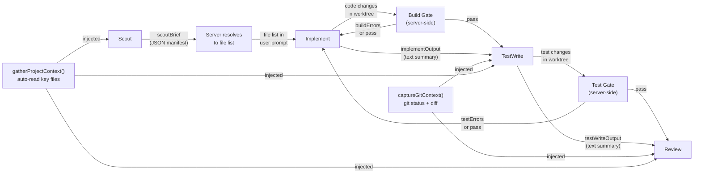
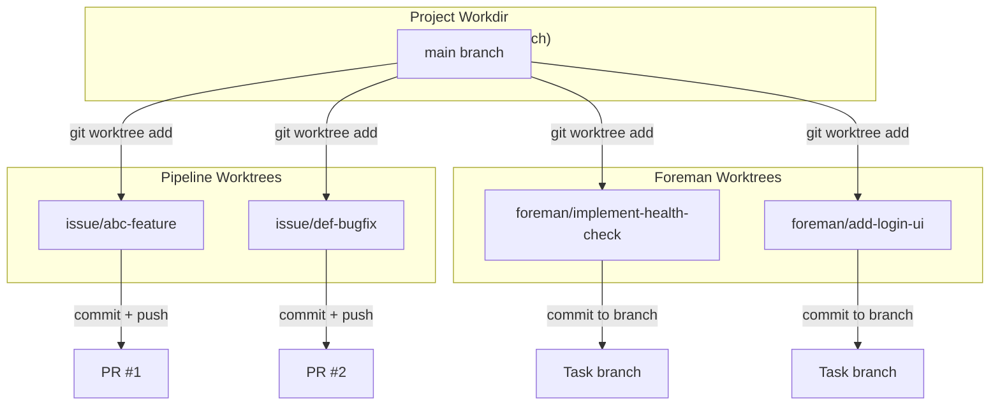
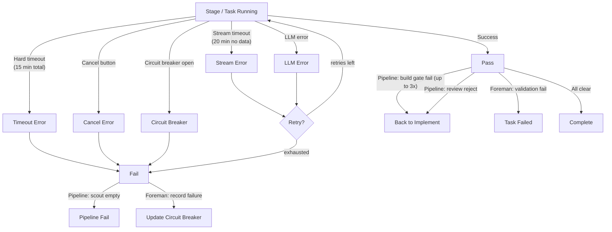

# Agent Harness

The harness is the infrastructure that runs LLM agents — managing their tools, context, prompts, and lifecycle. The agents themselves are stateless LLM calls; the harness provides everything around them.

There are two harness implementations:
1. **Pipeline harness** — runs pipeline stages (scout, implement, test-write, review) via LangGraph
2. **Foreman executor** — runs foreman tasks (code, review, content, claude) in git worktrees

Both share the same core pattern: build prompt → provide tools → run agent loop → enforce guards.

## What the Harness Does

The harness wraps each stage/task. It builds the prompt, hands the LLM a set of tools, runs the agent loop, logs each step, and enforces timeouts. The LLM itself is stateless — it just receives a prompt and responds with text or tool calls.

## Agent vs Harness Responsibilities

| Concern | Agent (LLM) | Harness (Code) |
|---------|-------------|----------------|
| **What to do** | Decides based on prompt + tools | Provides the issue/task description and file list |
| **How to do it** | Generates tool calls and code | Executes tool calls, returns results |
| **What tools exist** | Sees tool names + descriptions | Creates tool functions, controls which are available per stage |
| **File access** | Calls readFile/writeFile | Reads from worktree, enforces path boundaries |
| **Context window** | Manages within its limit | Controls prompt size, provides pre-loaded project files |
| **When to stop** | Produces result block | Enforces step limits, timeouts, abort signals |
| **Quality** | Follows coding standards in prompt | Review lenses catch violations (pipeline) / validator checks criteria (foreman) |
| **State between stages** | None — each stage is a fresh context | LangGraph persists state (pipeline) / DB tracks task state (foreman) |

## The Agent Loop

Each stage/task runs one agent loop via `streamText`:

Key points:
- The LLM has **no memory between stages** — each stage starts with a fresh system prompt and user message
- Tool calls and results accumulate **within** a stage (the AI SDK manages the conversation)
- The harness controls **which tools** each stage can access — scout gets read-only, implement gets read+write, review gets read+run
- **`onStepFinish`** fires after each tool call round-trip, allowing the harness to log progress

## Pipeline Harness: Tool Provisioning Per Stage

The pipeline harness creates different tool sets per stage to enforce boundaries:

| Tool | Scout | Implement | Test-Write | Review |
|------|:-----:|:---------:|:----------:|:------:|
| readFile | ✓ | ✓ | ✓ | ✓ |
| searchFiles | ✓ | ✓ | ✓ | ✓ |
| listDirectory | ✓ | ✓ | ✓ | ✓ |
| getFileInfo | ✓ | ✓ | ✓ | ✓ |
| writeFile | | ✓ | ✓ | |
| replaceInFile | | ✓ | | |
| appendToFile | | ✓ | ✓ | |
| deleteFile | | ✓ | | |
| moveFile | | ✓ | | |
| runCommand | | ✓ | ✓ | ✓ |
| gitStatus / gitDiff | | ✓ | | ✓ |
| saveCheckpoint | ✓ | | | |
| readRelevantFiles | | ✓ | | |
| checkBuild | | ✓ | ✓ | ✓ |
| checkTests | | ✓ | ✓ | ✓ |
| checkPackage | | ✓ | ✓ | |
| lookupDocs | | ✓ | ✓ | |
| getRelatedStories | ✓ | ✓ | | |
| findStory | ✓ | ✓ | | |

## Foreman Executor

The foreman executor (`foreman/executor.ts`) runs tasks in isolated git worktrees with a full tool set:

The foreman executor provides:
- **Full filesystem access** — read, write, search, run commands in the worktree
- **Web tools** — web search (DuckDuckGo), URL fetch, library docs lookup (Context7)
- **Task context** — task description, acceptance criteria, related task outputs, memory from `.swe/`
- **Curated memory tools** — a foreman-only subset (`makeForemanMemoryTools`) so
  task agents can read memory and write semantic notes, but cannot edit
  conventions or delete memory files
- **Acknowledgment seam** — `foreman_tasks.acknowledged_at` is stamped on the
  first dispatch so the scheduler knows the task has been picked up exactly once
- **Lease lifecycle** — acquires the machine lease via `withLlmSession`,
  auto-renews on every step, and registers an expiry abort that tears down
  the in-flight stream if the lease times out
- **Sandbox profile** — when `sandbox_enabled` is on, every subprocess the
  agent spawns (`runCommand`, `searchFiles`, gated build/test/lint) runs
  inside bubblewrap with the worktree mounted RW and host paths invisible
- **Post-processing** — git commit, branch management, optional YAML sync

### Hard scope rule

The foreman system prompt enforces a **stay-in-scope rule**: if the agent
discovers a problem in code outside its assigned `target_files`, it must
NOT try to fix it. It either:

1. Completes its assigned work and notes the discovery in `submitResult`, or
2. Calls `submitResult` with `BLOCKED: <reason>` if the out-of-scope problem
   prevents progress.

This prevents the common failure mode where an agent gets a small task,
spirals into debugging an unrelated subsystem, and burns the entire lease
window without writing a line of code. The categorical-stall detector in
`run-stage.ts` (see [Resilience](07-resilience.md)) is the mechanical
backstop for when the agent ignores the prompt.

## Prompt Strategy

Each stage/task gets a focused prompt. The harness doesn't use a shared "mega-prompt" — each context sees only what's relevant:

## Data Flow Between Pipeline Stages

Stages don't share context directly — the harness passes data through pipeline state:

Notes:
- `implementOutput` and `testWriteOutput` are only the LLM's **text** responses — not the full tool call history. The actual code changes live in the worktree (visible via `gitDiff`).
- Build/test errors are cleared when implement re-runs, preventing stale error accumulation.
- Gates only run when the project has `build_command` / `test_command` configured.

## Isolation Model

Both pipeline issues and foreman tasks get their own git worktrees:
- Multiple tasks/issues can run concurrently without conflicts
- Each agent sees a clean copy of the codebase
- Changes are isolated until merged
- **Pipeline worktrees** are cleaned up after the pipeline finishes (success or failure)
- **Foreman worktrees** are cleaned up on orchestrator startup via `cleanupWorktrees()` — removes worktrees for completed or failed tasks

## Error Handling

